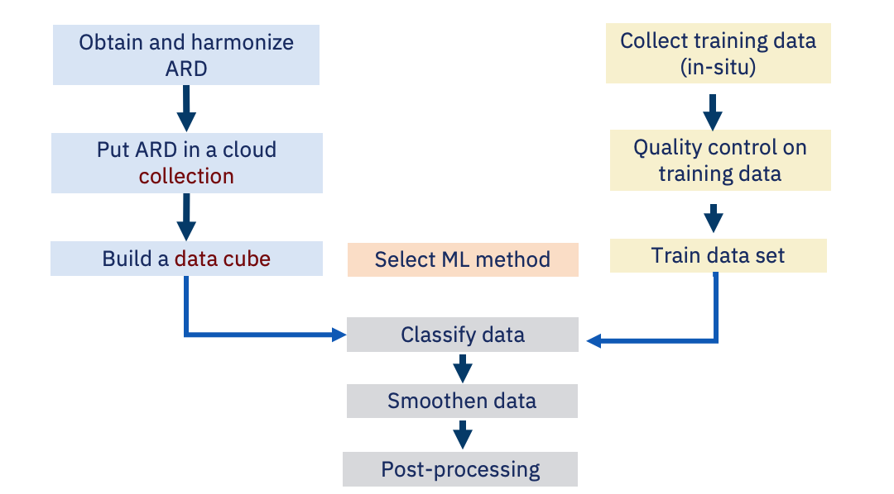

# Introduction

```{r, include = FALSE}
source("common.R")
```

---

This chapter present a broad overview of **sits**, showing its main functionality. For detailed description of the functions, please see the following chapters. 

---

Earth observation satellites provide a common and consistent set of information about the planet's land and oceans. Recently, most space agencies have adopted open data policies, making unprecedented amounts of satellite data available for research and operational use. This data deluge has brought about a significant challenge: *How to design and build technologies that allow the Earth observation community to analyze big data sets?*
  
The approach taken in **sits** is to develop data analysis methods that work with satellite image time series, obtained by taking calibrated and comparable measures of the same location in Earth at different times. These measures can be obtained by a single sensor (e.g., MODIS) or by combining various sensors (e.g., Landsat 8 and Sentinel-2). If acquired by frequent revisits, these data sets' temporal resolution can capture significant land use changes.

Time series of remote sensing data show that land cover can occur not only progressively and gradually, but they may also show discontinuities with abrupt changes [@Lambin2003]. Analyses of multiyear time series of land surface attributes, their fine-scale spatial pattern, and their seasonal evolution lead to a broader view of land-cover change. Satellite image time series have already been used in applications such as mapping for detecting forest disturbance [@Kennedy2010], ecology dynamics [@Pasquarella2016], agricultural intensification [@Galford2008], and its impacts on deforestation [@Arvor2012]. Algorithms for processing image time series include BFAST for detecting breaks [@Verbesselt2010], TIMESAT for modeling and measuring phenological attributes [@Jonsson2004], and methods based on Dynamic Time Warping (DTW) for land use and land cover classification [@Petitjean2012][@Maus2016]. 

In this work, we present **sits**, an open-source R package for satellite image time series analysis. It provides support on how to use machine learning techniques with image time series. These methods include linear and quadratic discrimination analysis, support vector machines, random forests, and neural networks. One important contribution of the package is to support the complete cycle of data analysis for time series classification, including data acquisition, visualization, filtering, clustering, classification, validation, and post-classification adjustments. 

Most studies using satellite image time series for land cover classification use a \emph{space-first, time-later} approach. For multiyear studies, most researchers first derive best-fit yearly composites and then classify each composite image [@Gomez2016]. As an alternative, the **sits** package provides support for the classification of time series, preserving the full temporal resolution of the input data, using a \emph{time-first, space-later} approach. The idea is to have as many temporal attributes as possible, increasing the classification space's dimension. Each temporal instance of a time series is taken as an independent dimension in the classifier's feature space. To the authors' best knowledge, the classification techniques for image time series included in the package are not previously available in other R or python packages. Furthermore, the package provides filtering, clustering, and post-processing methods that have not been published in the literature. 

Current approaches to image time series analysis still use a limited number of attributes. A common approach is deriving a small set of phenological parameters from vegetation indices, like the beginning, peak, and length of growing season [@Brown2013], [@Kastens2017], [@Estel2015], [@Pelletier2016]. These phenological parameters are then fed in specialized classifiers such as TIMESAT [@Jonsson2004]. These approaches do not use the power of advanced statistical learning techniques to work on high-dimensional spaces with big training data sets [@James2013]. Package **sits** uses the full depth of satellite image time series to create larger dimensional spaces, an approach we consider to be more appropriate to use with machine learning. 

```{r, echo = FALSE, out.width = "80%", out.height = "80%", fig.align="center", fig.cap="Using time series for land classification (source: Tan et al., 2017)"}
knitr::include_graphics("images/time_series_general_view.png")
```

## Workflow

The main aim of **sits** is to support land cover and land change classification of image data cubes using machine learning methods. The basic workflow is:

1. Create a data cube using analysis-ready-data image collections available in the cloud or local machines.
2. Extract time series from the data cube, which is used as training data.
3. Perform quality control and filtering on the samples. 
4. Train a machine learning model using the extracted samples.
5. Classify the data cube using the trained model.
6. Smoothen the probability data to reduce classification noise.
7. Post-process the classified images. 

```{r, echo = FALSE, out.width = "80%", out.height = "80%", fig.align="center", fig.cap="Workflow of using satellite image time series for classification"}


```


## Handling Data Cubes in **sits**

Currently, **sits** supports data cubes available in the following cloud services:

1. Sentinel-2/2A level 2A images in Amazon Web Services (AWS);
2. Collections of Sentinel, Landsat, and CBERS images in the Brazil Data Cube (BDC);
3. Collections available in Digital Earth Africa;
4. Data cubes produced by the [gdalcubes package](https://github.com/appelmar/gdalcubes);
5. Local image collections.

In order, to access different STAC cloud services supported by **sits**, the [rstac](http://github.com/brazil-data-cube/rstac) package is used. This package is developed under the Brazil Data Cube project and provides features for consuming STAC services. Besides, the [aws.s3](https://github.com/cloudyr/aws.s3) package is used to access data in AWS.

The use of different providers in the **sits** package is done with as few change as possible for users. The user can define a data cube by selecting a cloud service collection and determining a space-time extent. The code below shows the definition of a data cube using AWS Sentinel-2/2A images to exemplify how it is used.

```{r, eval = FALSE, echo = TRUE}
s2_cube <- sits_cube(
    source        = "AWS",
    name          = "T20LKP_2018_2019",
    collection    = "sentinel-s2-l2a",
    bands         = c("B08", "SCL"),
    tiles         = "20LKP",
    start_date    = as.Date("2018-07-18"),
    end_date      = as.Date("2018-08-18"),
    s2_resolution = 60
)
```

In the above example, the user has selected the "Sentinel-2 Level 2" collection in the AWS cloud services. The data cube's geographical area is defined by the tile "20LKP" and the temporal extent by a start and end date. Access to other cloud services works in similar ways (See Chapter 2 for more details),

To define a data cube using plain files (without STAC information), all image files should have the same spatial resolution and same projection. Each file contains a single image band for a single date. Timeline and bands are deduced from filenames. For example, `CBERS-4_AWFI_B13_2018-02-02.tif` is a valid name. The user has to provide parsing information to allow **sits** to extract the band and the date. In the example above, the parsing info is `c("X1", "X2", "band", "date")` and the delimiter is `"_"`.

```{r}
library(sits)
# Create a cube based on a stack of CBERS data
data_dir <- system.file("extdata/raster/cbers", package = "sits")

# files are named using the convention 
# "CBERS-4_AWFI_B13_2018-02-02.tif"
cbers_cube <- sits_cube(
      source = "LOCAL",
      name = "022024",
      satellite = "CBERS-4",
      sensor = "AWFI",
      data_dir = data_dir,
      delim = "_",
      parse_info = c("X1", "X2", "band", "date")
)

# print the timeline of the cube
sits_timeline(cbers_cube)

# print the bounding box of the cube
sits_bbox(cbers_cube)
```

## Handling satellite image time series in **sits**

### Data structure

Training a machine learning model in **sits** requires a set of time series describing properties in spatio-temporal locations of interest. This set consists of samples provided by experts that take *in-situ* field observations or recognize land classes using high-resolution images for land use classification. The package can also be used for any type of classification, provided that the timeline and bands of the time series (used for training) match that of the data cubes. 

The package uses a `sits tibble` to organize time series data with associated spatial information for handling time series. A `tibble` is a generalization of a `data.frame`, the usual way in *R* to organize data in tables. Tibbles is part of the `tidyverse`, a collection of R packages designed to work together in data manipulation [@Wickham2017]. As an example of how the **sits** tibble works, the following code shows the first three lines of a tibble containing $1,218$ labeled samples of land cover in the Mato Grosso state of Brazil, with four classes: "Forest", "Cerrado", "Pasture", "Soybean-Corn". 

```{r}
# data set of samples
data("samples_modis_4bands")
samples_modis_4bands[1:3,]
```

A `sits tibble` contains data and metadata. The first six columns contain the metadata: spatial and temporal information, the label assigned to the sample, and the data cube from where the data has been extracted. The spatial location is given in longitude and latitude coordinates for the "WGS84" ellipsoid. For example, the first sample has been labeled "Pasture" at location ($-55.1852$, $-10.8378$) and is valid for the period (2013-09-14, 2014-08-29).  The `time_series` column contains the actual data. 

### Obtaining time series data

To get a time series in **sits**, first is must necessarily create a data cube. Users can request one or more time series points from a data cube using `sits_get_data()`. This function provides a general means of access to image time series. Given data cue, the user provides the latitude and longitude of the desired location, the bands, and the start date and end date of the time series. If the start and end dates are not provided, it retrieves all the available periods. The result is a tibble that can be visualized using `plot()`.

```{r, fig.align="center", fig.height=3.1, fig.width=5, fig.cap="A one year time series of MOD13Q1 data for bands NDVI and EVI"}
library(sits)
data_dir <- system.file("extdata/raster/mod13q1", package = "sits")
modis_cube <- sits_cube(
    source = "LOCAL",
    name = "sinop-2014",
    satellite = "TERRA",
    sensor = "MODIS",
    data_dir = data_dir,
    delim = "_",
    parse_info = c("X1", "X2", "band", "date")
)

# obtain a set of locations defined by a CSV file
csv_raster_file <- system.file("extdata/samples/samples_sinop_crop.csv",
                               package = "sits")

# retrieve the points from the data cube
points <- sits_get_data(modis_cube, file = csv_raster_file)

# plot the first point
plot(points[1,])
```

## Filtering techniques 

The literature on satellite image time series has several filtering applications to correct or smooth vegetation index data. The following filters are available in **sits**. They are described in more detail in the vignette "Satellite Image Time Series Filtering with SITS":

* Savitzky–Golay filter (`sits_sgolay`)
* Whittaker filter (`sits_whittaker`)
* Envelope filter (`sits_envelope`)

The **sits** package uses a common interface to all filter functions with the `sits_filter`. The function has two parameters: the `dataset` to be filtered and the `filter` function applied. To aid in data visualization, all filtered bands have a suffix that is appended, as shown in the examples below. Here we show an example using the Whittaker smoother, proposed in the literature  [@Atzberger2011] as arguably the most appropriate one to use for satellite image time series. The Whittaker smoother attempts to fit a curve representing the raw data but is penalized if subsequent points vary too much [@Atzberger2011]. It balances between the residual to the original data and the "smoothness" of the fitted curve. It uses the parameter `lambda` to control the degree of smoothing. 

```{r, fig.align="center", fig.height=3.1, fig.width=5, fig.cap="Whittaker smoother filter applied on one-year NDVI time series. The example uses default $\\lambda=3$ parameter."}

# Take a NDVI time series, apply Whittaker filter and plot the series
point_ndvi <- sits_select(point_mt_6bands, bands = "NDVI")
point_whit <- sits_whittaker(point_ndvi, lambda = 5.0)

# merge with original data and plot the original and the filtered data
point_whit %>% 
  sits_merge(point_ndvi) %>% 
  plot()
```

## Clustering for sample quality control using self-organizing maps

One of the key challenges of machine learning classification models is assessing the training data sets' quality. It helps apply pre-processing methods to improve the samples' quality and remove those that might have been wrongly labeled or have low discriminatory power. Good samples lead to good classification maps.  **sits** provides support for two clustering methods to test sample quality: (a) Agglomerative Hierarchical Clustering (AHC); (b)  Self-organizing Maps (SOM).  Full details of the cluster methods used in **sits** are available in the vignette ['Clustering of Satellite Image Time Series with SITS'](https://github.com/e-sensing/sits-docs/blob/master/doc/clustering.pdf).

## Classification using machine learning 

There has been much recent interest in using classifiers such as support vector machines [@Mountrakis2011] and random forests [@Belgiu2016] for remote sensing images. Most often, researchers use a \emph{space-first, time-later} approach. The dimension of the decision space is limited to the number of spectral bands or their transformations. Sometimes, the decision space is extended with temporal attributes.  To do this, researchers filter the raw data to get smoother time series [@Brown2013; @Kastens2017]. Using software such as TIMESAT [@Jonsson2004], they derive a small set of phenological parameters from vegetation indexes, like the beginning, peak, and length of the growing season [@Estel2015; @Pelletier2016]. 

In a recent review of machine learning methods to classify remote sensing data [@Maxwell2018], the authors note that many factors influence these classifiers' performance, including the size and quality of the training dataset dimension of the feature space and the choice of the parameters. 

**sits** provides functionality to explore the full depth of satellite image time series data, treating time series as a feature vector. The idea is to have as many temporal attributes as possible, increasing the classification space's dimension. In this scenario, statistical learning models are the natural candidates to deal with high-dimensional data: learning to distinguish all land cover and land use classes from trusted samples exemplars (the training data) to infer classes of a larger data set. 

There is a common interface to all machine learning models, using the `sits_train` function. This function takes two parameters: the input samples and the ML method (`ml_method`), as shown below. After the model is estimated, it can classify individual time series or full data cubes using the `sits_classify` function. In the examples that follow, we show how to apply each method to classify a single time series. The trained model is then used to classify a time series from Mato Grosso Brazilian state, using `sits_classify`. The results can be shown in text format using the function `sits_show_prediction` or graphically using the `plot` function.

```{r, fig.align="center", fig.height=3.4, fig.width=5.5, fig.cap="Random forest classification of a $16$ years time series. The location (latitude, longitude) shown at the top of the graph is in geographic coordinate system (WGS84 {\\it datum})."}

#select the data for classification

# Train a machine learning model using Random Forest
rfor_model <- sits_train(data = samples_modis_4bands, 
                    ml_method = sits_rfor(num_trees = 1000))

# get a point to be classified
point_4bands <- sits_select(point_mt_6bands, 
                            bands = c("NDVI", "EVI", "NIR", "MIR"))

# Classify using random forest model and plot the result
class <- sits_classify(point_4bands, rfor_model)
# plot the results of the prediction
plot(class)
```

The following methods are available in **sits** for training machine learning models:

* Linear discriminant analysis (`sits_lda`)
* Quadratic discriminant analysis (`sits_qda`)
* Multinomial logit and its variants 'lasso' and 'ridge' (`sits_mlr`)
* Support vector machines (`sits_svm`)
* Random forests (`sits_rfor`)
* Extreme gradient boosting (`sits_xgboost`)
* Deep learning (DL) using multi-layer perceptrons (`sits_deeplearning`)
* DL with 1D convolutional neural networks (`sits_CNN`), 
* DL combining 1D CNN and multi-layer perceptron networks (`sits_tempCNN`)
* DL using 1D version of ResNet (`sits_ResNet`).
* DL using a combination of long-short term memory (LSTM) and 1D CNN (`sits_LSTM_FCN`)

For more details on each method, please see Chapter 5. 

## Validation techniques

Validation is a process undertaken on models to estimate some errors associated with them. Hence, it has been used widely in different scientific disciplines. Here, we are interested in assessing the prediction error associated with some models. For this purpose, we concentrate on the *cross-validation* approach, probably the most used validation technique [@Hastie2009]. `sits_kfold_validate()` supports the k-fold validation in **sits**. The following code gives an example of how to proceed *k-fold cross-validation* in the package. It performs a five-fold validation using the SVM classification model as a default classifier. We can see in the output text the corresponding confusion matrix and the accuracy statistics (overall and by class).

```{r}
# perform a five fold validation for the "cerrado_2classes" data set
# Random Forest machine learning method using default parameters
acc <- sits_kfold_validate(cerrado_2classes, 
                           folds = 5, 
                           ml_method = sits_rfor(num_trees = 1000))
```

## Cube classification

To classify a data cube, use the function `sits_classify()` as described below. Once a data cube that has associated files is defined, the steps for classification are:

1. Select a set of training samples;
2. Train a machine learning model;
3. Classify the data cubes using the model, producing a data cube with class probabilities;
4. Label the cube with probabilities, including data smoothing if desired.

To reduce processing time, it is necessary to adjust `sits_classify()` according to the server's capabilities. The package tries to keep memory use to a minimum, performing garbage collection to free memory as often as possible. Nevertheless, there is an inevitable trade-off between computing time, memory use, and I/O operations. The best trade-off must be determined by the user, considering disk read speed, number of cores in the server, and CPU performance.

The first parameter is `memsize`. It controls the size of the main memory (in GBytes) to be used for classification. The second factor controlling the performance of raster classification is `multicores`, which specifies the number of  cores are assigned to classification.

```{r, fig.align="center", fig.cap="Class probabilities for each pixel"}
# Retrieve the set of samples for the Mato Grosso region 
# Select the data for classification
samples_2bands  <- sits_select(samples_modis_4bands, 
                               bands = c("NDVI", "EVI"))

# build a machine learning model for this area
svm_model <- sits_train(samples_2bands, sits_svm())

# create a data cube to be classified
# Cube is composed of MOD13Q1 images from the Sinop region in Mato Grosso (Brazil)
data_dir <- system.file("extdata/raster/mod13q1", package = "sits")
sinop <- sits_cube(
    source = "LOCAL",
    name = "sinop-2014",
    satellite = "TERRA",
    sensor = "MODIS",
    data_dir = data_dir,
    parse_info = c("X1", "X2", "band", "date")
)
# Classify the raster cube, generating a probability file
probs_cube <- sits_classify(sinop, 
                            ml_model = svm_model, 
                            output_dir = tempdir(),
                            memsize = 16,
                            multicores = 4,
                            verbose = FALSE)

# plot the probabilities cubes
plot(probs_cube)
```

## Smoothing and Labelling of raster data after classification

Doing post-processing using Bayesian smoothing in **sits** is straightforward. The result of the `sits_classify` function applied to a data cube is a set of more probability images, one per requested classification interval. The next step is to use the `sits_smooth` function. By default, this function selects the most likely class for each pixel, using a Bayesian estimator that considers the neighbors. The following example takes the previously produced classification output and applies a Bayesian smoothing. 

```{r, out.width = "90%", out.height = "90%", fig.align="center", fig.cap="Classified image post-processed with Bayesian smoothing"}
# smooth the result with a bayesian filter
sinop_bayes <- sits_smooth(probs_cube, output_dir = tempdir())
# label the resulting image
label_bayes <- sits_label_classification(sinop_bayes, output_dir = tempdir())
# plot the result
plot(label_bayes)
```

## Final remarks


## Acknowledgements

The authors would like to thank all the researchers that provided data samples used in the examples: Alexandre Coutinho, Julio Esquerdo, and Joao Antunes (Brazilian Agricultural Research Agency, Brazil) who provided ground samples for "soybean-fallow", "fallow-cotton", "soybean-cotton", "soybean-corn", "soybean-millet", "soybean-sunflower", and "pasture" classes; Rodrigo Bergotti (National Institute for Space Research, Brazil) who provided samples for "cerrado" and "forest" classes; and Damien Arvor (Rennes University, France) who provided ground samples for "soybean-fallow" class. 

This work was partially funded by the São Paulo Research Foundation (FAPESP) through the eScience Program grant 2014/08398-6. We thank the Coordination for the Improvement of Higher Education Personnel (CAPES) and National Council for Scientific and Technological Development (CNPq) grants 312151/2014-4 (GC) and 140684/2016-6 (RS). We thank Ricardo Cartaxo and Lúbia Vinhas, who provided insight and expertise to support this paper.

This work has also been supported by the International Climate Initiative of the Germany Federal Ministry for the Environment, Nature Conservation, Building and Nuclear Safety under Grant Agreement 17-III-084-Global-A-RESTORE+ (``RESTORE+: Addressing Landscape Restoration on Degraded Land in Indonesia and Brazil''). 

