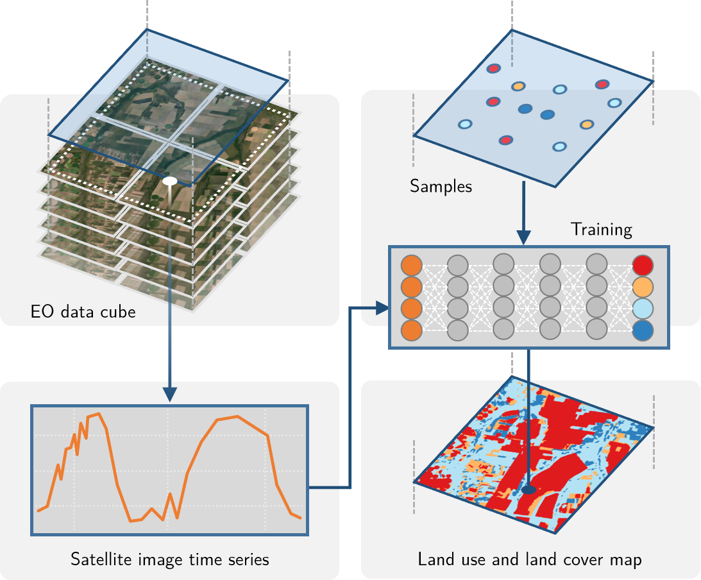

# (PART) Overview {-}

# A taste of sits

```{r, include = FALSE}
source("common.R")
```

---

This chapter present an overview of **sits** by showing an application example. For detailed description of the functions, please see the following chapters. 

---

Earth observation (EO) satellites provide a common and consistent set of information about the planet's land and oceans. Recently, most space agencies have adopted open data policies, making unprecedented amounts of satellite data available for research and operational use. This data deluge has brought about a significant challenge: *How to design and build technologies that allow the Earth observation community to analyze big data sets?* 

In this book, we present **sits**, an open-source R package for satellite image time series analysis. It provides support on how to use machine learning techniques with image time series. The package supports the complete cycle of data analysis for time series classification, including data acquisition, visualization, filtering, clustering, classification, validation, and post-processing.

The *sits* package adopts a *time-first, space-later* approach, where each spatial location is associated to a time series. A set of locations with known labels is used to train a machine learning classifiers. The resulting model is applied to the data cube and each time series is classified separately. After the classification, spatial smoothing methods capture information from neighbors. This approach is illustrated in Figure \@ref(fig:sits-overview).

```{r sits-overview, echo = FALSE, out.width = "70%", out.height = "70%", fig.align="center", fig.cap="Using time series for land classification (source: authors)"}

```

## Creating a Data Cube 

In what follows, we introduce **sits** by showing a simple example fo land use and land cover classification. The first step is creating a data cube. The data cube is a set of analysis-ready MODIS MOD13Q1 images for the Sinop region of the State of Mato Grosso, Brazil, in the bands "NDVI" and "EVI", covering a one-year period from 2013-09-14 ^[In this book, we follow the convention "year-month-day" for dates]. Each band has 23 instances, each covering a 16-day period, which is the standard for the MOD13Q1 product[@Didan2015].  The data is available in the R package "sitsdata", which contains data for the examples in this book. The code below shows how to create data cubes from local files. To work with data cubes in repositories such as AWS, MS/AZURE and the Brazil Data Cube, please see [Chapter  2](https://e-sensing.github.io/sitsbook/earth-observation-data-cubes.html)

```{r, fig.align="center", fig.cap="EVI band for 2013-09-14"}
data_dir <- system.file("extdata/sinop", package = "sitsdata")

# create a raster metadata file based on the information about the files
sinop_cube <- sits_cube(source = "LOCAL",
                   satellite = "TERRA",
                   sensor  = "MODIS",
                   name = "Sinop",
                   data_dir = data_dir
)
# plot the EVI band for the first date (2013-09-14)
plot(sinop_cube, band = "EVI", time = 1)
```
The `sits_cube()` function defines a *data cube*, which is an organized collection of images covering a geographical area in a given time interval. Data cubes can be conceived as a 3D array of pixels, where each pixel is associated to a time series. All pixels share the same timeline and the same set of attributes (usually spectral bands).  When a data cube is defined, the values of the images are not loaded in memory.  The output of `sits_cube` is a object-relational data table, which contains the metadata that describes the actual image data. For more details on how to define and work with data cubes, please see  

## The time series table

To classify all of the time series associated to a data cube, **sits** uses machine learning models. FTo train the models, **sits** uses a tabular data structure that stores individual time series. The example below shows a table with 1,218 time series obtained from MODIS MOD13Q1 images.  Each series has four attributes: two bands ("NIR" and "MIR") and two indexes ("NDVI" and "EVI"). This data set is available in package "sitsdata". 

```{r}
# load the MODIS samples for Mato Grosso from the "sitsdata" package
library(sitsdata)
data("samples_matogrosso_mod13q1", package = "sitsdata")
samples_matogrosso_mod13q1[1:3,]
```
The data structure associated to the time series is a table that contains data and metadata. The first six columns contain the metadata: spatial and temporal information, the label assigned to the sample, and the data cube from where the data has been extracted. The `time_series` column contains the time series data for each spatiotemporal location. This data is also organized as a table, with a column with the dates and the other columns with the values for each spectral band. For more details on how to handle time series data, please see [Chapter 3](https://e-sensing.github.io/sitsbook/acessing-time-series-information-in-sits.html). 

It is useful to visualise the disperson of the time series. In what follows, for brevity we will select only one label ("Forest") and one index ("EVI") to show. The resulting plot shows all of the time series associated to the label and attribute, highlighting the median and the first and third quartiles. 
```{r}
samples_pasture <- dplyr::filter(samples_matogrosso_mod13q1, label == "Forest")
samples_pasture_ndvi <- sits_select(samples_pasture, band = "NDVI")
plot(samples_pasture_ndvi)
```

## Training a machine learning model

After obtaining the time series, the next step is to select a suitable subset to use as training samples for a machine learning model. In this case, the time series data has four attributes ("EVI", "NDVI", "NIR", "MIR") and the data cube is composed only with data from the "NDVI" and "EVI" indexes.  We extract the "NDVI" and "EVI" indexes from the time series data set and use the resulting data for training a model. To build the classification model, we have chosen `sits_TempCNN()` from the methods available. This method implements a 1D convolution neural network [@Pelletier2019]. After training the model, we plot the result to how well it has converged to match the input data. For more details on the machine learning methods please see [Chapter 5](https://e-sensing.github.io/sitsbook/machine-learning-for-data-cubes-using-the-sits-package.html). 

```{r, fig.cap="Validation of TempCNN model"}
# select the bands "ndvi", "evi"
samples_2bands <- sits_select(samples_matogrosso_mod13q1, bands = c("NDVI", "EVI"))

#select a tempCNN model
tcnn_model <- sits_train(data = samples_2bands, 
                        ml_method = sits_TempCNN())
plot(tcnn_model)
```
## Data cube classification

The next step is to classify the data cube. This is achived by using the `sits_classify()` function. The classification produces a set of probability maps, one for each class. For each map, the value of a pixel is proportional to the the probability that it belongs to the class. To visualise the result, we plot the probability maps. In the example below, for clarity's sake, we show the maps of two classes ("Forest" and "Pasture"). Details of the classification process are available in [Chapter 6](https://e-sensing.github.io/sitsbook/classification-of-images-in-data-cubes-using-satellite-image-time-series.html). 

```{r, fig.cap = "Probability map for classes of each pixel"}

# classify the raster image
sinop_probs <- sits_classify(data = sinop_cube, 
                             ml_model = tcnn_model)

plot(sinop_probs, labels = c("Forest", "Pasture"))
```

## Spatial smoothing

When working with big EO data sets, there is a considerable degree of data variability in each class. As a result, some pixels will be misclassified. These errors are more likely to occur in transition areas between classes or when dealing with mixed pixels. To offset these problems, **sits** includes a post-processing smoothing method based on Bayesian probability. The `sits_smooth()` function uses information from a pixel's neighborhood to reduce uncertainty about its label, which is illustrated below. After smoothing, we plot the probability maps for classes "Forest" and "Pasture" to compare with the previous plot. For more discussion on post-processing and smoothing methods, please see [Chapter 7 7](https://e-sensing.github.io/sitsbook/post-classification-smoothing-using-bayesian-techniques-in-sits.html).

```{r, "Smoothed probability maps"}
# perform spatial smoothing
sinop_smooth <- sits_smooth(sinop_probs)
plot(sinop_smooth, labels = c("Forest", "Pasture"))
```
## Labelling a probability data cube

After removal of outliers using local smoothing, one can obtain the labeled classification map using the `sits_label_classification()` function which assigns each pixel to the class with highest probability. 

```{r, fig.cap= "Labeled classification map"}

# label the probability file 
# (by default selecting the class with higher probability)
sinop_label <- sits_label_classification(sinop_smooth)
plot(sinop_label, title = "Sinop-label")
```

The resulting classification files can be read by QGIS. Links to the  associated files are available in the `sinop_label` table in the column `file_info`. 

```{r}
# show the location of the classification file
sinop_label$file_info[[1]]
```


## How the sits API works 

The core functions of the **sits** API are presented in Figure \@ref(fig:api). Each function carries out one task of the land classification workflow.  These functions are: (a) `sits_cube()` which creates a cube; (b) `sits_get_data()` which extracts training data from the cube; (c) `sits_train()` that trains a machine learning model; (d) `sits_classify()` which classifies the cube; (e) `sits_smooth()` that does the spatial smoothing; and (f) `sits_label_classication()` that produces the final labelled image. These six functions encapsulate the core of the package.  Each of these core functions is described in a chapter in this book. 

```{r api, echo = FALSE, out.width = "80%", out.height = "80%", fig.align="center", fig.cap="Main functions of the SITS API"}

knitr::include_graphics("images/sits_api.png")
```


## Final remarks

The **sits** package provides an API to build EO data cubes from image collections available in cloud services, and to perform land classification of data cubes using machine learning. The classification models are built based on  satellite image time series extracted from the cubes. The package provides additional function for sample quality control, post-processing and validation. The design of the API tries to reduce complexity for users and hide details such as how to do parallel processing, and to handle data cubes composed by tiles of different timelines.
