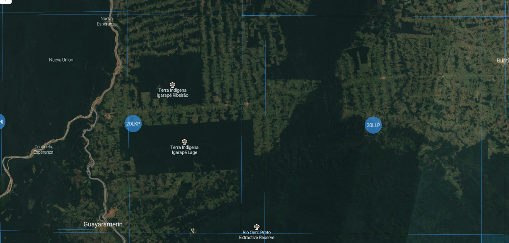

# Earth observation data cubes

```{r, include = FALSE}
source("common.R")
```

---

This chapter describes how to use Earth observation data cubes in SITS.

---

## Image data cubes as the basis for big Earth observation data analysis

Given the large sizes of the collections of Earth observation data available, there is a clear trend to users to perform their analsys using cloud computing. In this configuration, cloud services archive large satellite-generated data sets and provide computing facilities to process them. In this way, users can share big Earth observation databases and minimize data download. Investment in infrastructure is minimized, and sharing of data and software increases. 

To take full advantage of the cloud computing model, Earth observation data needs to be available to users as data cubes, whose aim is to organise satellite data for a given area in a consistent spatiotemporal arrangement. Generalizing [@Appel2019], we consider the following definition:

1. A *data cube* is a four-dimensional structure with dimensions x (longitude or easting), y (latitude or northing), time, and bands.
2. Its spatial dimensions refer to a single spatial reference system (SRS). Cells of a data cube have a constant spatial size with respect to the cube’s SRS.
3. A set of intervals specifies the temporal dimension.
4. For every combination of dimensions, a cell has a single value.

Data cubes are particularly amenable for machine learning; their data can be transformed into arrays in memory, fed to training and classification algorithms. Conceptually, a data cube defines a compact space. For all positions inside its spatial temporal extent, it is possible to obtain a valid set of values from every band of the images which are included in it (see Figure \@ref(fig:dcconcept)). 

```{r dcconcept, echo = FALSE, out.width = "90%", out.height = "90%", fig.align="center", fig.cap="Conceptual view of data cubes (source: Kopp et al., 2019)"}
knitr::include_graphics("images/data_cubes_conception.png")
```

This idealized vision of data cubes does not correspond to the reality. Data available in cloud services such as AWS, Microsoft and Digital Earth Africa is better described as collections of analysis-ready data (ARD). Such data is defined by the Committee on Earth Observation Satellites (CEOS) as "satellite data that have been processed to a minimum set of requirements and organized into a form that allows immediate analysis with a minimum of additional user effort and interoperability both through time and with other datasets" [@Potapov2020]. In practice, ARD label is applied to images that have been processed by space agencies to improve multidate comparability. This processing includes conversion from radiance measures at the top of the atmosphere to reflectance measures from ground areas. Variations in sun incidence angles are also compensated. The image is usually reprocessed to a well-known cartographic projection. These data sets are better characterized as "ARD image collections", defined as:

1. An ARD image collection is set of files from a given sensor (or combined set of sensors) that has been corrected to ensure comparability of measurements between different dates.
2. All images are reprojected to a cartographic projection following well-established standards.
3. Image collections are usually cropped into a tiling system, where each tile is associated to a different timeline than the other tiles. 

The use of tiling systems for ARD data has been adopted by space agencies for many land satellites. For example, the Sentinel-2 tiling system uses the Military Grid Reference System (MGRS) and its naming convention derived from the UTM (Universal Transverse Mercator). Use of tiling system enables users to more easily choose an area of interest. Figure \@ref(fig:tilesro) with the location of two Sentinel-2 tiles (20LLP and 20LKP) covering part of the state of Rondonia, Brazil. 

```{r tilesro, echo = FALSE, out.width = "90%", out.height = "90%", fig.align="center", fig.cap="Illustration of Sentinel-2 tiling system (source: www.remotepixel.ca)."}

```

There are important distinctions between ARD image collections and data cubes. Image collections do not guarantee that every pixel of an image has a valid value, since ARD still contains cloudy pixels. Also, each tile of an image collection has a unique timeline. Using the Sentinel-2 level 2A image collection as an example, consider neighboring tiles "20LLP" and "20LKP". Figure \@ref(fig:imagesro) shows images of tile "20LKP" for different dates. Some of images have a significant number of clouds. Ideally, these clouds should be replaced by a valid value before being ingested into a data cube. 

```{r imagesro, echo = FALSE, out.width = "90%", out.height = "90%", fig.align="center", fig.cap="Sentinel-2 for tile 20LKP in different dates (source: authors)."}
knitr::include_graphics("images/sentinel-2_20lkp_images.png")
```

A further point concerns the timeline of different tiles. For example, consider the Sentinel-2 tiles "20LLP" and "20LKP" for the period 2018-07-13 to 2019-07-28. Tile 20LKP has 71 temporal instances and tile 20 LLP has 144 instances. Users that want to process large areas cannot thus rely only on ARD image collections being compatible with data cube properties. There are three options available for users aiming to classify areas that span more than one tile:

1. Use cloud providers whose data fully adheres to a data cube definition. The Brazil Data Cube (BDC) is an example. 
2. Use tools that generate regularly spaced cubes in time from image collection, as does the `sits_regularize` function in *sits*.
3. Provide additional information to *sits* to allow the software to deal with multi-tile image collections.

Since option (1) is not generally available to users other than those of the BDC, and option (2) requires the creation of additional files to compose a proper data, the developers of *sits* are working to provide full support to multitile data cubes, in a user-transparent way. This facility is not yet available in *sits* 0.11.0, but it is planned for version 1.00.00. 

## Using STAC to Access Image Collection

With the coming of age of big Earth observation data, it is not always practical to transfer large data sets. Users have to rely on web services to provide access to these data sets. To obtain information on cloud image collection, *sits* uses information provided by STAC (SpatioTemporal Asset Catalogue), by means of the [rstac](http://github.com/brazil-data-cube/rstac) package. [STAC] (https://stacspec.org/) is a specification of geospatial information which has been adopted by many large image collection providers (e.g., AWS, Microsoft, USGS). A 'spatiotemporal asset' is any file that represents information about the earth captured in a certain space and time. 

## Accessing data cubes in Amazon Web Services

Users of Amazon Web Services (AWS) can access image collections
available in the 'Earth on AWS' services using *sits*. For AWS, *sits* currently 
only works with collection "sentinel-s2-l2a". This will be extended in later versions. 

To work with AWS,  users need to provide credentials using environment variables.
```{r,eval = FALSE}
Sys.setenv(
    "AWS_ACCESS_KEY_ID"     = <your_access_key>,
    "AWS_SECRET_ACCESS_KEY" = <your_secret_access_key>,
    "AWS_DEFAULT_REGION"    = <your AWS region>,
    "AWS_ENDPOINT"          = <your AWS endpoint>,
    "AWS_REQUEST_PAYER"     = "requester"
)
```

Sentinel-2/2A level 2A files in AWS are organized by sensor resolution. 
The AWS bands in 10m resolution are "B02", "B03", "B04", and "B08". 
The  20m bands are "B02", "B03", "B04", "B05", "B06", "BO7", B08", "B8A", "B11", and "B12". 
All 12 bands are available at 60m resolution. Thus, to create data cubes in AWS using  Sentinel-2/2A, users need to specify the `s2_resolution` parameter. In the example below, the user selects two Sentinel-2A tiles following the S2A tiling system. Each S2A tile is an 100x100 km2 orthoimage in UTM/WGS84 projection.

```{r, eval = FALSE}
# creating a data cube in AWS
s2_cube <- sits_cube(source = "AWS",
                     name = "T20LKP_2018_2019",
                     collection = "sentinel-s2-l2a",
                     tiles = c("20LKP","20LLP"),
                     start_date = as.Date("2018-07-18"),
                     end_date = as.Date("2018-07-23"),
                     s2_resolution = 20
)
```

Instead of specifying the region of interest by listing the image collection tiles, users can also provide a bounding box (`bbox`) whose parameters allow a selection of an area of interest. Bounding boxes can be defined using: (a) a named vector ("xmin", "ymin", "xmax", "ymax") with lat/long values in WGS 84; (b) an *sfc* or *sf* object from the **sf** package; or (c) a GeoJSON geometry (RFC 7946). When selecting images that compose a data cube based on a `bbox`, sits does does not crop them, and selects the images that intersect with it. When doing the classification using `sits_classify`, only the pixels inside the bounding box will be processed.

In short, the output of the `sits_cube` function is composed of metadata about the images that satisfy the requirements stated in its parameters (spatiotemporal extent, resolution, and area of interest). The `s2_cube` object created in the above statement is a tibble that has the information required for further processing, but does not contain the actual data. 

## Accessing the Brazil Data Cube

The Brazil Data Cube \footnote{ \url{http://brazildatacube.org/} } (BDC) is being developed by Brazil’s National Institute for Space Research (INPE). Its goal is to create multidimensional data cubes of analysis-ready data from medium-resolution EO images for all Brazil. 

The organization of data cubes in BDC is based on a spatial partition of the territory. This partition is represented by a grid of tiles where every pixel can be efficiently located within a tile. Considering the spatial resolution of the images and aimed at maintaining files that can be easily manageable, three hierarchical grids were defined using an Albers Equal Area projection and SIRGAS 2000 datum. The three grids are generated taking -54 longitude as the central reference and defining tiles of $6\times4$, $3\times2$ and $1.5\times1$ degrees.

```{r, echo = FALSE, out.width = "50%", out.height = "50%", fig.align="center", fig.cap="Hierarchical BDC tiling system showing overlayed on Brazilian Biomes (a), illustrating that one large tile (b) contains four medium tiles (c) and that medium tile contains four small tiles"}

knitr::include_graphics("images/bdc_grid.png")
```

The large grid is composed by tiles of approximately $672\times440$ km^2^ and is used to organize CBERS-4 AWFI collections, each tile represents an image of $10,504\times6,865$ pixels. The medium grid is used in the Landsat-8 OLI collections, the tiles have an extension of 336 x 220 kilometers and images of 11,204 x 7,324 pixels. The small grid present tiles of approximately 168 x 110 kilometers and is used on Sentinel-2 MSI collections (10m), with images of 16,806 x 10,986 pixels. 

To access the Brazil Data Cube, users need to provide their credentials using environmental variables.
```{r,eval = FALSE}
Sys.setenv(
    "BDC_ACCESS_KEY" = <your_bdc_access_key>
)
```

Creating a data cube using the BDC is similar to what is required for AWS. The user 
needs to specific an image collection, a spatiotemporal extent, bands, and optionally a bounding box.  In the example, we have selected the  "CB4_64_16D_STK-1" collection (CBERS AWFI images at 16 days) that complies with the BDC large tile specification. Other collections include "LC8_30_16D_STK-1" (Landsat OLI images at 16 days) and "S2_10_16D_STK-1" (Sentinel-2 MSI images at 16 days).

```{r, eval = FALSE}
cbers_tile <- sits_cube(
    source = "BDC",
    collection = "CB4_64_16D_STK-1",
    name = "cbers_022024",
    bands = c("NDVI", "EVI"),
    tiles = "022024",
    start_date = "2018-09-01",
    end_date = "2019-08-28"
)
```

## Defining a data cube using files

To define a data cube using plain files (without STAC information), users should organise files in a single directory. All files should have the same spatial resolution and same projection. Each file should contain a single image band for a single date. Since raster files in popular formats (e.g., GeoTiff and JPEG 2000) do not include time information, each filename needs to include date and band information. For example, `CBERS-4_AWFI_B13_2018-02-02.tif` is a valid name. The user should provide parsing information to allow *sits* to extract the band and the date. In the example above, the parsing info is `c("X1", "X2", "band", "date")` and the delimiter is `"_"`.

```{r, eval = FALSE}
library(sits)
# Create a cube based on a stack of CBERS data
data_dir <- system.file("extdata/raster/cbers", package = "sits")

# files are named using the convention 
# "CBERS-4_AWFI_B13_2018-02-02.tif"
cbers_cube <- sits_cube(
      source = "LOCAL",
      name = "022024",
      satellite = "CBERS-4",
      sensor = "AWFI",
      data_dir = data_dir,
      delim = "_",
      parse_info = c("X1", "X2", "band", "date")
)
```


## Regularizing data cubes 

Analysis-ready data (ARD) collections available in AWS and DE Africa do not have consistent timelines. In general, images in neighboring tiles have different timelines. This is a problem when classifying large areas, In this case, users may want to produce data cubes with regular time intervals.  For example, a user may want to define the best Sentinel-2 pixel in a one-month period. This can be done in *sits* by the `sits_regularize`, which calls the "gdalcubes" package. For details in gdalcubes, please see [https://github.com/appelmar/gdalcubes](https://github.com/appelmar/gdalcubes).

```{r, eval = FALSE, echo = TRUE}
gc_cube <- sits_regularize(
          cube       = s2_cube,
          name       = "T20LKP_20LLP_2018_2019_1M",
          dir_images = tempdir(),
          period     = "P1M",
          agg_method = "median",
          resampling = "bilinear",
          cloud_mask = TRUE
)
```

In the above example, the user has selected the `s2_cube` object defined using AWS (see example above). As described earlier in this chapter, because of the way ARD image collections are built, the timelines of tiles "20LLP" and "20LKP" associated with this cube are different. The `sits_regularize` function builds a new data cube, with the same temporal extent as the `s2_cube` but with the same timeline. In this function, the `period` parameter controls the temporal interval between two images. Values should abide by the ISO8601 time period specification, which states that time interval should be defined as "P[n]Y[n]M[n]D", where Y stands for "years", "M" for months and "D" for days. Thus, "P1M" stands for a one-month period, "P15D" for a fifteen-day period. 

When joining different images to get the best image for a period, `sits_regularize` uses an aggregation method, defined by the parameter `agg_method`. It specifies how individual values of different pixels should be combined. The default is `median`, which select the most frequent value for the pixel during the desired interval. For more details, see `?sits_regularize`.


