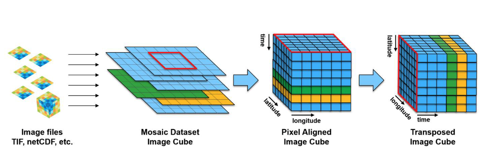
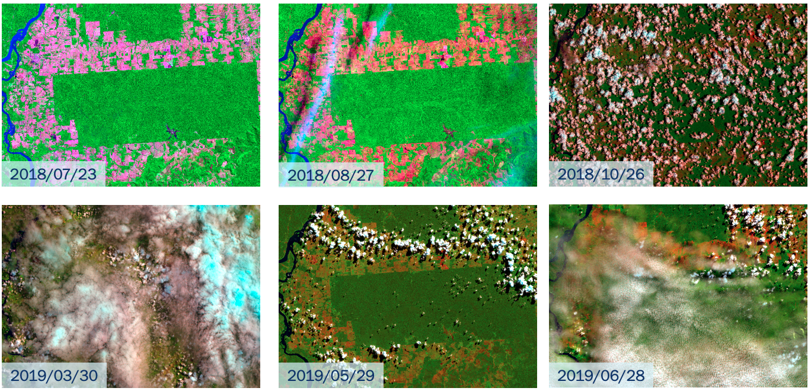

# Earth observation data cubes

```{r, include = FALSE}
source("common.R")
```

---

This chapter describes how to use Earth observation data cubes in SITS.

---

## Image data cubes as the basis for big Earth observation data analysis

Given the large sizes of the collections of Earth observation data available, there is a clear trend to use cloud computing. In this configuration, cloud services archive large satellite-generated data sets and provide computing facilities to process them. Users can share big Earth observation databases and minimize data download. Investment in infrastructure is minimized, and sharing of data and software increases. 

To take full advantage of the cloud computing model, Earth observation data needs to be available to users as *data cubes*, whose aim is to organize satellite data for a given area in a consistent spatiotemporal arrangement. Generalizing [@Appel2019], we consider the following definition:

1. A data cube is a four-dimensional structure with dimensions x (longitude or easting), y (latitude or northing), time, and bands.
2. Its spatial dimensions refer to a single spatial reference system (SRS). Cells of a data cube have a constant spatial size with respect to the cube’s SRS.
3. A set of intervals specifies the temporal dimension.
4. For every combination of dimensions, a cell has a single value.

Conceptually, a data cube defines a compact space. For all positions inside its spatiotemporal extent, it is possible to obtain a valid set of measures. For each position in space, the data cube should provide a valid time series. For each time interval, the data cube should provide a valid 2D image (see Figure \@ref(fig:dcconcept)). Data cubes provide a useful abstraction for algorithms that extract information from big EO data sets. Machine learning and deep learning algorithms require the input data to be consistent. The dimensionality of the data used for training the model has to be the same as that of the data to be classified. There should be no gaps in the input data and no missing values are allowed. 

Currently, few cloud providers adhere to the full definition of data cubes. One exception is the Brazil Data Cube (BDC) [@Ferreira2020a], which provides data cubes which are regular in both spatial and temporal dimension. 

```{r dcconcept, echo = FALSE, out.width = "90%", out.height = "90%", fig.align="center", fig.cap="Conceptual view of data cubes (source: authors)"}

```

## Analysis-ready data image collections 

Data available in cloud services such as AWS, Microsoft Planetary Computer, and Digital Earth Africa does not adhere to the definition of data cubes stated above. These data sets are better described as collections of analysis-ready data (ARD) which have been processed by space agencies to improve multidate comparability. Such processing includes conversion from radiance measures at the top of the atmosphere to reflectance measures from ground areas. Variations in sun incidence angles are also compensated. The image is usually reprocessed to a well-known cartographic projection. We define *ARD image collections* as:

1. An ARD image collection is a set of files from a given sensor (or a combined set of sensors) that has been corrected to ensure comparability of measurements between different dates.
2. All images are reprojected to a cartographic projection following well-established standards.
3. Image collections are cropped into a tiling system. In general, the timeline of different tiles do not match. 

ARD image collections do not guarantee that every pixel of an image has a valid value. Images still contains cloudy or missing pixels. Figure \@ref(fig:imagesro) shows images of tile "20LKP" of the Sentinel-2 Level 2A collection available in AWS for different dates. Some of images have a significant number of clouds. The values of cloudy pixels should be replaced by valid values before being ingested into a data cube. 

```{r imagesro, echo = FALSE, out.width = "90%", out.height = "90%", fig.align="center", fig.cap="Sentinel-2 for tile 20LKP in different dates (source: authors)."}

```

A further point concerns the timeline of different tiles. Consider the neighboring Sentinel-2 tiles "20LLP" and "20LKP" for the period 2018-07-13 to 2019-07-28, as they are available in AWS. Tile 20LKP has 71 temporal instances and tile 20 LLP has 144 instances. To process large areas, all tiles have to be organized to follow the same timeline. Thus, users cannot rely on ARD image collections when working with large areas. Users that want to work on multiples tiles of an ARD image collection should use the `sits_regularize()` function to generate regularly spaced cubes in time from image collection. Please see the session "Regularizing data cubes" below. 

## Accessing Data Cubes and Image Collections in SITS

To obtain information on cloud image collection, *sits* uses information provided by implementations of the STAC (SpatioTemporal Asset Catalogue) protocol. [STAC] (https://stacspec.org/) is a specification of geospatial information which has been adopted by many large image collection providers (e.g., AWS, Microsoft, USGS). A 'spatiotemporal asset' is any file that represents information about the earth captured in a certain space and time. To access STAC endpoints, *sits* uses the [rstac](http://github.com/brazil-data-cube/rstac) R package.

### Accessing data cubes in Amazon Web Services

Users of Amazon Web Services (AWS) can access image collections
available in the 'Earth on AWS' services using *sits*. For AWS, *sits* currently 
works with collection "sentinel-s2-l2a". This will be extended in later versions. 

To work with AWS,  users need to provide credentials using environment variables.
```{r,eval = FALSE}
Sys.setenv(
    "AWS_ACCESS_KEY_ID"     = <your_access_key>,
    "AWS_SECRET_ACCESS_KEY" = <your_secret_access_key>,
    "AWS_DEFAULT_REGION"    = <your AWS region>,
    "AWS_ENDPOINT"          = <your AWS endpoint>,
    "AWS_REQUEST_PAYER"     = "requester"
)
```

Sentinel-2 level 2A files in AWS are organized by sensor resolution. 
The AWS bands in 10m resolution are "B02", "B03", "B04", and "B08". 
The  20m bands are "B02", "B03", "B04", "B05", "B06", "BO7", B08", "B8A", "B11", and "B12". 
All 12 bands are available at 60m resolution. To create data cubes in AWS using  Sentinel-2 images, users need to specify the `s2_resolution` parameter. In the example below, the user selects two Sentinel-2 tiles. Each S2 tile is an 100x100 km2 orthoimage in UTM/WGS84 projection.

```{r, eval = FALSE}
# creating a data cube in AWS
s2_cube <- sits_cube(source = "AWS",
                     name = "T20LKP_2018_2019",
                     collection = "sentinel-s2-l2a",
                     tiles = c("20LKP","20LLP"),
                     start_date = as.Date("2018-07-18"),
                     end_date = as.Date("2018-07-23"),
                     s2_resolution = 20
)
```

The output of the `sits_cube` function is composed of metadata about the images that satisfy the requirements stated in its parameters (spatiotemporal extent, resolution, and area of interest). The `s2_cube` object created in the above statement is a tibble that has the information required for further processing, but does not contain the actual data. 

Instead of specifying the region of interest by listing the image collection tiles, users can also provide a bounding box (`bbox`) whose parameters allow a selection of an area of interest. Bounding boxes can be defined using: (a) a named vector ("xmin", "ymin", "xmax", "ymax") with lat/long values in WGS 84; (b) an *sf* object from the *sf* package, a data frame with feature attributes and feature geometries; or (c) a GeoJSON geometry (RFC 7946). When selecting images that compose a data cube based on a `bbox`, sits does not crop them directly; the software selects the images that intersect with it. The information is used later by `sits_classify()`, when only the pixels inside the bounding box will be processed.


### Accessing the Brazil Data Cube

The [Brazil Data Cube](http://brazildatacube.org/) (BDC) is being developed by Brazil’s National Institute for Space Research (INPE). Its goal is to create multidimensional data cubes of analysis-ready data Brazil. The BDC uses three hierarchical grids based on the Albers Equal Area projection and SIRGAS 2000 datum. The three grids are generated taking -54 $^\circ$ longitude as the central reference and defining tiles of $6\times4$, $3\times2$ and $1.5\times1$ degrees. The large grid is composed by tiles of $672\times440$ km^2^ and is used for CBERS-4 AWFI collections at 64 meter resolution; each CBERS-4 AWFI tile contains images of $10,504\times6,865$ pixels. The medium grid is used for Landsat-8 OLI collections at 30 meter resolution; tiles have an extension of $336\times220$ km^2^ and each image has $11,204\times7,324$ pixels. The small grid covers $168\times110$ km^2^ and is used for Sentinel-2 MSI collections at 10m resolutions; each image has $16,806\times10,986$ pixels. The data cubes in the BDC are regularly spaced in time and cloud-corrected. 

```{r, echo = FALSE, out.width = "50%", out.height = "50%", fig.align="center", fig.cap="Hierarchical BDC tiling system showing overlayed on Brazilian Biomes (a), illustrating that one large tile (b) contains four medium tiles (c) and that medium tile contains four small tiles"}

knitr::include_graphics("images/bdc_grid.png")
```

To access the Brazil Data Cube, users need to provide their credentials using environmental variables.
```{r,eval = FALSE}
Sys.setenv(
    "BDC_ACCESS_KEY" = <your_bdc_access_key>
)
```

Creating a data cube using the BDC is similar to what is required for AWS. The user 
defines an image collection, a spatiotemporal extent, bands, and optionally a bounding box.  In the example below, the data cube is defined as one tile ("022024") of "CB4_64_16D_STK-1" collection which holds CBERS AWFI images at 16 days resolution. Other collections include "LC8_30_16D_STK-1" (Landsat OLI images at 16 days) and "S2_10_16D_STK-1" (Sentinel-2 MSI images at 16 days).

```{r, eval = FALSE}
cbers_tile <- sits_cube(
    source = "BDC",
    collection = "CB4_64_16D_STK-1",
    name = "cbers_022024",
    bands = c("NDVI", "EVI"),
    tiles = "022024",
    start_date = "2018-09-01",
    end_date = "2019-08-28"
)
```

### Defining a data cube using files

In some cases, users have downloaded files from image collections and have them available in their computer or in a local network. As *sits* does not have access to STAC information that describe the files, they should be organized and named to allow SITS to create a data cube. 

All files should be in the same directory and have the same spatial resolution and projection. Each file should contain a single image band for a single date. Since raster files in popular formats (e.g., GeoTiff and JPEG 2000) do not include temporal and band information, each file name needs to include date and band. For example, `CBERS-4_AWFI_B13_2018-02-02.tif` and `SENTINEL-2_MSI_L_20_KP_ 20m_B08_2021_03_29.jp2` are 
is a valid name. The user should provide parsing information to allow *sits* to extract the band and the date. In the example above, the parsing info is `c("X1", "X2", "band", "date")` and the delimiter is `"_"`.

```{r, eval = FALSE}
library(sits)
# Create a cube based on a stack of CBERS data
data_dir <- system.file("extdata/raster/cbers", package = "sits")

# files are named using the convention 
# "CBERS-4_AWFI_B13_2018-02-02.tif"
cbers_cube <- sits_cube(
      source = "LOCAL",
      name = "022024",
      satellite = "CBERS-4",
      sensor = "AWFI",
      data_dir = data_dir,
      delim = "_",
      parse_info = c("X1", "X2", "band", "date")
)
```


## Regularizing data cubes 

Analysis-ready data (ARD) collections available in AWS and DE Africa do not have consistent timelines. In general, images in neighboring tiles have different timelines. This is a problem when classifying large areas, In this case, users may want to produce data cubes with regular time intervals.  For example, a user may want to define the best Sentinel-2 pixel in a one-month period. This can be done in *sits* by the `sits_regularize`, which calls the "gdalcubes" package[@Appel2019]. For details in gdalcubes, please see [https://github.com/appelmar/gdalcubes](https://github.com/appelmar/gdalcubes).

```{r, eval = FALSE, echo = TRUE}
gc_cube <- sits_regularize(
          cube       = s2_cube,
          name       = "T20LKP_20LLP_2018_2019_1M",
          dir_images = tempdir(),
          period     = "P1M",
          agg_method = "median",
          resampling = "bilinear",
          cloud_mask = TRUE
)
```

In the above example, the user has selected the `s2_cube` object defined using AWS (see example above). As described earlier in this chapter, because of the way ARD image collections are built, the timelines of tiles "20LLP" and "20LKP" associated with this cube are different. The `sits_regularize` function builds a new data cube, with the same temporal extent as the `s2_cube` but with the same timeline. In this function, the `period` parameter controls the temporal interval between two images. Values should abide by the ISO8601 time period specification, which states that time interval should be defined as "P[n]Y[n]M[n]D", where Y stands for "years", "M" for months and "D" for days. Thus, "P1M" stands for a one-month period, "P15D" for a fifteen-day period. 

When joining different images to get the best image for a period, `sits_regularize` uses an aggregation method, defined by the parameter `agg_method`. It specifies how individual values of different pixels should be combined. The default is `median`, which select the most frequent value for the pixel during the desired interval. For more details, see `?sits_regularize`.


