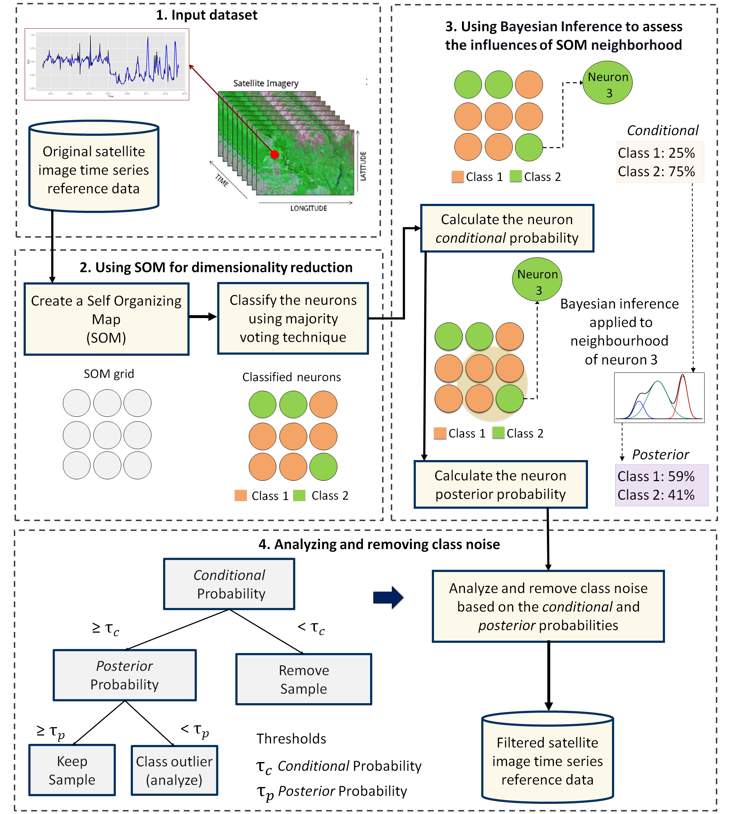

# (PART) Clustering {-}

# Time Series Clustering to Improve the Quality of Training Samples

```{r, include = FALSE}
source("common.R")
```

---

One of the key challenges when using samples to train machine learning classification models is assessing their quality. Noisy and imperfect training samples can have a negative effect on classification performance.  Therefore, it is useful to apply pre-processing methods to improve the quality of the samples and to remove those that might have been wrongly labeled or that have low discriminatory power. `sits` provides two clustering methods to improve sample quality: agglomerative hierarchical clustering (AHC) and self-organizing maps (SOM).

---

## Clustering for sample quality control: overview
 
Experience with machine learning methods has established that the limiting factor in obtaining good results is the number and quality of training samples. Large and accurate data sets are better, no matter the algorithm used [@Maxwell2018]; noisy training samples can have a negative effect on classification performance [@Frenay2014]. 

When assessing the quality of training samples, it is useful to distinguish between samples that have been wrongly labelled and differences that result from natural variability of class signatures. When training data is collected over a large geographic region, natural variability of vegetation phenology can result in different patterns being assigned to the same label. Phenological patterns can vary spatially across a region and are strongly correlated with climate variations. A related issue is the limitation of crisp boundaries to describe the natural world. Class definition use idealized descriptions (e.g., "a savanna woodland has tree cover of 50\% to 90\% ranging from 8 to 15 meters in height"). In practice, the boundaries between classes are fuzzy and sometimes overlap, making it hard to distinguish between them. Therefore, it is useful to apply pre-processing methods to improve the quality of the samples and to remove those that might have been wrongly labeled or that have low discriminatory power. Representative samples lead to good classification maps. The package provides support for two clustering methods to test sample quality: (a) Agglomerative Hierarchical Clustering (AHC); (b) Self-organizing Maps (SOM).

The two methods have different computational complexities. As discussed below, AHC results are somewhat easier to interpret than those of SOM. However, AHC has a computational complexity of $\mathcal{O}(n^2)$ given the number of time series $n$, whereas SOM complexity is linear with respect to n. Therefore, for large data sets, AHC requires an substantial amount of memory and running time; in these cases, SOM is recommended. 

## Hierachical clustering for sample quality control

Agglomerative hierarchical clustering (AHC) computes the dissimilarity between any two elements from a data set. Depending on the distance functions and linkage criteria, the algorithm decides which two clusters are merged at each iteration. This approach is useful for exploring data samples due to its visualization power and ease of use [@Keogh2003]. In `sits`, AHC is implemented using `sits_cluster_dendro()`. 

```{r dendrogram, cache=TRUE, fig.align="center", fig.height=5, fig.width=8, message=FALSE}
# take a set of patterns for 2 classes
# create a dendrogram, plot, and get the optimal cluster based on ARI index
clusters <- sits_cluster_dendro(samples = cerrado_2classes, 
                                bands = c("NDVI", "EVI"),
                                dist_method = "dtw_basic",
                                linkage =  "ward.D2"
)
```

The `sits_cluster_dendro()` function has one mandatory parameter (`samples`), where users should provide the name of the R object containing the data samples to be evaluated. Optional parameters include `bands`, `dist_method` and `linkage`. The `dist_method` parameter specifies how to calculate the distance between two time series.  We recommend a metric that uses dynamic time warping (DTW)[@Petitjean2012], as DTW is reliable method for measuring differences between satellite image time series [@Maus2016]. The options available in `sits` are based on those provided by package `dtwclust`, which include "dtw_basic", "dtw_lb", and "dtw2". Please check `?dtwclust::tsclust` for more information on DTW distances. 

The `linkage` parameter defines the metric used for computing the distance between clusters.  The recommended linkage criteria are: "complete" or "ward.D2".  Complete-linkage prioritizes the within-cluster dissimilarities, producing clusters with shorter distance samples. Complete-linkage clustering can be sensitive to outliers, which can increase the resulting intracluster data variance. As an alternative, Ward proposes criteria to minimize the data variance by means of either *sum-of-squares* or *sum-of-squares-error* [@Ward1963]. Ward's intuition is that clusters of multivariate observations, such as time series, should be approximately elliptical in shape [@Hennig2015].

After creating a dendrogram, an important question emerges: *where to cut the dendrogram?* The answer depends on what are the purposes of the cluster analysis, which needs to balance two objectives: get clusters as large as possible, and get clusters as homogeneous as possible with respect to their known classes. The `sits_cluster_dendro()` function computes the *adjusted rand index* (ARI) for a series of the different number of generated clusters. This function returns the height where the cut of the dendrogram maximizes the index. For more detaily, please see [@Rand1971].

In the example above after calculating the dendrogram, the ARI index indicates that six (6) clusters are the best possible arrangement. However, these clusters may still contain a mixed composition of samples of different classes. 

The result of the `sits_cluster` operation is a `sits_tibble` with one additional column, called "cluster". The function `sits_cluster_frequency()` provides information on the composition of each cluster,  

```{r}
clusters
# show clusters samples frequency
sits_cluster_frequency(clusters)
```

The result shows that the clusters have a predominance of either "Cerrado" or "Pasture" classes with the exception of cluster $3$. The contingency table plotted by `sits_cluster_frequency()` shows how the samples are distributed across the clusters and helps identify two kinds of problems. The first is relative to small amounts of samples in clusters dominated by another class (*e.g.* clusters $1$, $2$, $4$, $5$, and $6$), while the second is relative to those samples in non-dominated clusters (*e.g.* cluster $3$). These confusions can be an indication of samples with poor quality, and inadequacy of selected parameters for cluster analysis, or even a natural confusion due to the inherent variability of the land classes.

It is possible to remove clusters with mixed classes using the `dplyr` package. In the example above, removing cluster $3$ can be done using the `dplyr::filter()` function.

```{r}
# remove cluster 3 from the samples
clusters_new <- dplyr::filter(clusters, cluster != 3)

# show new clusters samples frequency
sits::sits_cluster_frequency(clusters_new)
```

The resulting clusters still contained mixed labels, possibly resulting from outliers. In this case, users may want to remove the outliers and leave only the most frequent class. To do this, one can use `sits_cluster_clean()`, which removes all minority samples, as shown below.

```{r}
# clear clusters, leaving only the majority class in each cluster
clean <- sits_cluster_clean(clusters_new)
# show clusters samples frequency
sits_cluster_frequency(clean)
```
After cleaning the samples using dendrograms, users are expected to have a better set of samples which will provide more accurate estimates of land classification. 

## Using self-organizing maps for sample quality control

<a href="https://www.kaggle.com/brazildatacube/sits-clustering-r" target="_blank"></a>

As an alternative for hierarchical clustering for quality control of training samples, SITS provides a clustering technique based on self-organizing maps (SOM). SOM is a dimensionality reduction technique [@Kohonen1990], where high-dimensional data is mapped into a two dimensional map, keeping the topological relations between data patterns. As the shown in the Figure below, the SOM 2D Map is composed by units called \emph{neurons}. Each neuron has a weight vector, with the same dimension as the training samples. At the start, neurons are assigned a small random value and then trained by competitive learning. The algorithm computes the distances of each member of the training set to all neurons and finds the neuron closest to the input,  called the best matching unit (BMU). 

```{r, out.width = "90%", out.height = "90%", echo = FALSE, fig.align="center", fig.cap="SOM 2D map creation (source: Santos et al.(2021)"}

knitr::include_graphics("images/som_structure.png")
```

The input data for quality assessment is a set of training samples. Training samples associated to satellite image time series are high-dimensional data sets. A time series of 25 instances of 4 spectral bands has 100 dimensions. When projecting a high-dimensional data set of training samples into a 2D SOM map, the units of the map (called *neurons*) compete for each sample. Each time series will be mapped to one of the neurons. Since the number of neurons is smaller than the number of classes, each neuron will be associated to many time series. The resulting 2D map will be a set of clusters. Given that SOM preserves the topological structure of neighborhoods in multiple dimensions, clusters that contain training samples of a given class will usually be neighbors in 2D space. Therefore, the neighbours of each neuron of a SOM map provide information on intraclass and interclass variability which is used to detect noisy samples. The methodology of using SOM for sample quality assessment (see Figure below) is discussed in detail in the reference paper [@Santos2021a].  

```{r, out.width = "90%", out.height = "90%", echo = FALSE, fig.align="center", fig.cap="Using SOM for class noise reduction (source: Santos et al.(2021)"}


```


As an example, we take a time series dataset from the Cerrado region of Brazil, the second largest biome in South America with an area of more than 2 million km2. The training samples were collected by ground surveys and high-resolution image interpretation by experts from the Brazilian National Institute for Space Research (INPE) team and partners. This set ranges from 2000 to 2017 and includes 50,160 land use and cover samples divided into 12 classes("Dense_Woodland", "Dunes", "Fallow_Cotton", "Millet_Cotton", "Pasture", "Rocky_Savanna", "Savanna", "Savanna_Parkland", "Silviculture", "Soy_Corn", "Soy_Cotton", "Soy_Fallow"). Each time series covers 12 months (23 data points) from MOD13Q1 product, and has 4 bands ("EVI", "NDVI", "MIR", and "NIR"). 

```{r, message = FALSE, warning = FALSE}
# load library sitsdata
library(sitsdata)
library(tibble)
# take only the NDVI and EVI bands
samples_cerrado_mod13q1_2bands <- sits_select(samples_cerrado_mod13q1, bands = c("NDVI", "EVI"))
# show the summary of the samples
sits_labels_summary(samples_cerrado_mod13q1_2bands)
```

### SOM-based quality assessment part 1: creating the SOM map

To run the SOM-based quality assessment, the first step is to run `sits_som_map()` which uses the "kohonen" R package [@Wehrens2018] to compute a SOM grid. Each sample is assigned to a neuron, and neurons are placed in the grid based on similarity. This function has six main parameters. In `data`, the user should provide the name of the R object containing the samples. The size of the SOM map grid is controlled by `grid_xdim` and `grid_ydim`. The starting learning rate is set using `alpha`; this learning rate decreases during the interactions. The distance metric is controlled by `distance`; options available currently are "sumofsquares" and "euclidean". The number of iterations is set by `rlen`. For more details on the implementation, please also consult `?kohonen::supersom`. 

```{r, message = FALSE, warning = FALSE}
# clustering time series using SOM
som_cluster <-
    sits_som_map(
        data = samples_cerrado_mod13q1_2bands,
        grid_xdim = 15,
        grid_ydim = 15,
        alpha = 1.0,
        distance = "euclidean",
        rlen = 20
    )
```

The output of the `sits_som_map()` is a list with 4 tibbles:

- the original set of time series with two additional columns for each time series: `id_sample` (the original id of each sample) and `id_neuron` (the id of the neuron to which it belongs).
- a tibble with information on the neurons. For each neuron, it gives the prior and posterior probabilities of all labels which occur in the samples assigned to it. 
- the SOM grid
```{r}
som_cluster
```

To plot the SOM grid, use `plot()`. The neurons are labelled using the majority voting.
```{r}
plot(som_cluster)
```

The SOM grid has 225 neurons, as defined by the product of the parameters `grid_xdim` and `grid_ydim` in the `sits_som_map()`. Looking at the SOM grid, one can see that most of the neurons of a class are located close to each other, as expected. However, some "Pasture" neurons far from the main cluster. This mixture is a consequence of the continuous nature of natural vegetation cover in the Brazilian Cerrado. The transition between areas of open savanna and pasture is not always well defined; moreover, it is dependent on factors such as climate and latitude. The SOM grid provides a general view of the capacity of the samples to distinguish the chosen labels. 

### SOM-based quality assessment part 2: assessing confusion between labels

The second step in SOM-based quality assessment is understanding the confusion between labels. The function `sits_som_evaluate_cluster()` groups neurons by their majority label and produces a tibble.  For each label, the tibble show the percentage of samples with a different label that have been mapped to a neuron whose majority is that label. 

To plot the SOM grid, use `plot()`. The neurons are labelled using the majority voting.
```{r}
# produce a tibble with a summary of the mixed labels
som_eval <- sits_som_evaluate_cluster(som_cluster)
# show the result
som_eval 
```
As seen above, almost all labels are associated to clusters where there are some samples with a different label. Such confusion between labels arises because visual labeling of samples is subjective and can be biased. In many cases, interpreters use high-resolution data to identify samples. However, the actual images to be classified are captured by satellites with lower resolution. In our case study, a MOD13Q1 image has pixels with 250 x 250 meter resolution. Therefore, the correspondence between labelled locations in high-resolution images and mid to low-resolution images is not direct. Therefore, the SOM-based analysis is useful to select only homogeneous pixels. 

The confusion by class can be visualised in a bar plot using `plot()`, as shown below. The bar plot shows some confusion between the classes associated to the natural vegetation typical of the Brazilian Cerrado ("Savanna", "Savanna_Parkland", "Rocky_Savanna"). This mixture is due to the large variability of the natural vegetation of the Cerrado biome, which makes it difficult to draw sharp boundaries between each label. Some confusion is also visible between the agricultural classes ("Soy_Corn", "Soy_Cotton" and "Soy_Fallow").

```{r}
# plot the confusion between clusters
plot(som_eval)
```


### SOM-based quality assessment part 3: using probabilities to detect noisy samples

The third step in the quality assessment uses the discrete probability distribution associated to each neuron. The probability information is included in the `labelled_neurons` tibble which is produced by `sits_som_map()` (see above). More homogeneous neurons (those with a single class of high probability) are assumed to be composed of good quality samples. Heterogeneous neurons (those with two or more classes with significant probability) are likely to contain noisy samples. The algorithm computes two values for each sample:

- prior probability: the probability that the label assigned to the sample is correct, considering only the samples contained in each same neuron.  For example, if a neuron has 20 samples, of which 15 are labeled as "Pasture" and 5 as "Forest", all samples labeled "Forest" are assigned a prior probability of 25%. This is an indication that the "Forest" samples in this neuron are not of good quality.
- posterior probability: the probability that the label assigned to the sample is correct, considering the neighboring neurons. Take the case of the above-mentioned neuron whose samples labeled "Pasture" have a prior probability of 75%. What happens if all the neighboring samples have "Forest" as a majority label? Are the samples labeled "Pasture" in this neuron noisy? To answer this question, we use information from the neighbors. Using Bayesian inference, we estimate if these samples are noisy based on the samples of the neighboring neurons [@Santos2021]. 

To identify noisy samples, we take the result of the `sits_som_map()` function as the first argument to the function `sits_som_clean_samples()`. This function finds out which samples are noisy, those that are clean, and some that need to be further examined by the user. It requires `prior_threshold` and `posterior_threshold` parameters according to the following rules: 

- If the prior probability of a sample is less than `prior_threshold`, the sample is assumed to be noisy and tagged as "remove";
- If the prior probability is greater or equal to `prior_threshold` and the posterior probability is greater or equal to `posterior_threshold`, the sample is assumed not to be noisy and thus is tagged as "clean"; 
- If the prior probability is greater or equal to `prior_threshold`  and the posterior probability is less than `posterior_threshold`, we have a situation the sample is part of the majority level of those assigned to its neuron, but its label is not consistent with most of its neighbors. This is an anomalous condition and  is tagged as "analyze". Users are encouraged to inspect such samples to find out whether they are in fact noisy or not. 

The default value for both `prior_threshold` and `posterior_threshold` is 60%. The `sits_som_clean_samples()` has an additional parameter (`keep`) which indicates which samples should be kept in the set based on their prior and posterior probabilities of being noisy and the assigned label. The default value for `keep` is `c("clean", "analyze")`. As a result of the cleaning, about 900 samples have been considered to be noisy and thus removed.

```{r, message = FALSE, warning = FALSE}
new_samples <- sits_som_clean_samples(som_cluster, 
                                      prior_threshold = 0.6,
                                      posterior_threshold = 0.6,
                                      keep = c("clean", "analyze"))
# find out how many samples are evaluated as "clean" or "analyze"
new_samples %>% 
  dplyr::group_by(eval) %>% 
  dplyr::summarise(count = dplyr::n(), .groups = "drop")
```

### Comparing Original and Clean Samples

To compare the original and clean samples, we run a 5-fold validation on the original and on the cleaned sample set, using the function `sits_kfold_validate()` and a random forest model.  As the results show, the SOM procedure is useful, since the validation improves from 95% to 99%. It should be noted that a k-fold validation procedure measures how well the machine learning model fits the samples and is not a measure of accuracy of the classification. For more details on accuracy measures, please see [Chr 8](https://e-sensing.github.io/sitsbook/validation-and-accuracy-measurements-in-sits.html).

```{r, message = FALSE, warning = FALSE}
# run a k-fold validation
assess_orig <- sits_kfold_validate(samples_cerrado_mod13q1_2bands, 
                                   ml_method = sits_rfor(num_trees = 200))
# print summary 
sits_accuracy_summary(assess_orig)
```

```{r, message = FALSE, warning = FALSE}
assess_new <- sits_kfold_validate(new_samples, 
                                   ml_method = sits_rfor(num_trees = 200))
# print summary 
sits_accuracy_summary(assess_new)
```


An additional way of evaluating the quality of samples is to examine the internal
mixture inside neurons with the same label. We call a group of neurons sharing
the same label as a "cluster". Given a SOM map, the function `sits_som_evaluate_cluster`
examines all clusters to find out the percentage of samples contained in it which do not share its label. This information is saved as a tibble and can also
be visualized.
 
```{r, message = FALSE, warning = FALSE}
# evaluate the misture in the SOM clusters
cluster_mixture <- sits_som_evaluate_cluster(som_cluster)
# plot the mixture information.
plot(cluster_mixture)
```

## Conclusion

Machine learning methods are now established as a useful technique for remote sensing image analysis. Despite the well-known fact that the quality of the training data is a key factor in the accuracy of the resulting maps, the literature on methods for detecting and removing class noise in SITS training sets is limited. To contribute to solving this challenge, this paper proposed a new technique. The proposed method uses the SOM neural network to group similar samples in a 2D map for dimensionality reduction. The method identifies both mislabeled samples and outliers that are flagged to further investigation. The results demonstrate the positive impact on the overall classification accuracy. Although the class noise removal adds an extra cost to the entire classification process, we believe that it is essential to improve the accuracy of classified maps using SITS analysis mainly for large areas.