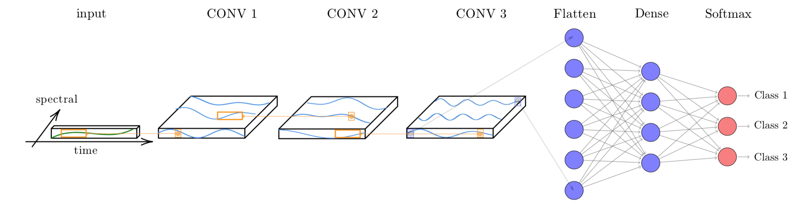

---
output:
  pdf_document: default
  html_document: default
---
# (PART) Classification {-}

# Machine Learning for Data Cubes using the SITS package

<!-- [](https://www.kaggle.com/brazildatacube/sits-classification-r) -->

```{r, include = FALSE, echo = FALSE}
source("common.R")
```

---

This chapter presents the machine learning (ML) techniques available in SITS. The main use for machine learning in SITS is for classification of land use and land cover. These machine learning methods available in SITS include linear and quadratic discrimination analysis, support vector machines, random forests, deep learning and neural networks.

---

## Machine learning classification 

<a href="https://www.kaggle.com/brazildatacube/sits-classification-r" target="_blank"></a>

The package provides support for the classification of time series, preserving the full temporal resolution of the input data. Instead of extracting metrics from time series segments, it uses all values of the time series. It supports two kinds of machine learning methods. The first group of methods does not explicitly consider spatial or temporal dimensions; these models treat time series as a vector in a high-dimensional feature space. From this class of models, `sits` includes random forests[@Belgiu2016], support  vector machines[@Mountrakis2011],  extreme gradient boosting[@Chen2016], and multi-layer perceptrons[@Parente2019a]. 

The second group of models comprises deep learning methods specifically designed to work with time series. Temporal relations between observed values in a time series are taken into account.  Time series classification models for satellite data include 1D convolution neural networks (1D-CNN) [@Pelletier2019, @Fawaz2020], recurrent neural networks (RNN)[@Russwurm2018], and~attention-based deep learning [@Garnot2020a, @Russwurm2020]. The `sits` package supports two 1D-CNN algorithms: TempCNN[@Pelletier2019] and ResNet[@Fawaz2019]. For models based on 1D-CNN, the order of the samples in the time series is relevant for the classifier. Each layer of the network applies a convolution filter to the output of the previous layer. This cascade of convolutions captures time series features in different time scales [@Pelletier2019]. 

Thus, the following machine learning methods are available in SITS:

* Support vector machines (`sits_svm()`)
* Random forests (`sits_rfor()`)
* Extreme gradient boosting (`sits_xgboost()`)
* Deep learning (DL) using multi-layer perceptrons (`sits_mlp()`)
* DL using Deep Residual Networks (`sits_ResNet()`) 
* DL with 1D convolutional neural networks (`sits_TempCNN()`)

For the machine learning examples, we use the data set "samples_matogrosso_mod13q1", containing a sits tibble with time series samples from Brazilian Mato Grosso State (Amazon and Cerrado biomes), obtained from the MODIS MOD13Q1 product. The tibble with 1,892 samples and 9 classes ("Cerrado", "Fallow_Cotton", "Forest", "Millet_Cotton", "Pasture","Soy_Corn", "Soy_Cotton", "Soy_Fallow", "Soy_Millet"). Each time series comprehends 12 months (23 data points) with 6 bands ("NDVI", "EVI", "BLUE", "RED", "NIR", "MIR"). The dataset was used in the paper "Big Earth observation time series analysis for monitoring Brazilian agriculture" [@Picoli2018], and is available in the R package "sitsdata", which is downloadable from the website associated to the "e-sensing" project. 

The following examples show how to train ML and apply it to classify a single time series; they should not be taken as indication of which method performs better. The most important factor for achieving a good result is the quality of the training data [@Maxwell2018]. Given a good set of samples, users of `sits` should be able to get good results. For examples of ML for classifying large areas, please see [Chapter 6](https://e-sensing.github.io/sitsbook/classification-of-images-in-data-cubes-using-satellite-image-time-series.html) and the papers by the authors [@Picoli2018, @Picoli2020a, @Simoes2020, @Ferreira2020a]. 


## Visualizing Samples 

One useful way of describing and understanding the samples is by plotting them. A direct way of doing so is using the `plot` function, as discussed in [Chapter  3](https://e-sensing.github.io/sitsbook/acessing-time-series-information-in-sits.html). In the plot, the thick red line is the median value for each time instance and the yellow lines are the first and third interquartile ranges. 

```{r, fig.cap="Visualisation of samples associated to class Forest in band NDVI"}
data("samples_matogrosso_mod13q1")
# Select a subset of the samples to be plotted
# Retrieve the set of samples for the Mato Grosso region 
samples_matogrosso_mod13q1 %>% 
    sits_select(bands = "NDVI") %>% 
    dplyr::filter(label == "Forest") %>% 
    plot()
```

An alternative to visualise the samples is to estimate a statistical approximation to an idealized pattern based on a generalised additive model (GAM). A GAM is a linear model in which the linear predictor depends linearly on a smooth function of the predictor variables
$$
y = \beta_{i} + f(x) + \epsilon, \epsilon \sim N(0, \sigma^2).
$$
The function `sits_patterns()` uses a GAM to predict a smooth, idealized approximation to the time series associated to the each label, for all bands. This function is based on the R package `dtwSat`[@Maus2019], which implements the TWDTW time series matching method described in @Maus2016. The resulting patterns can be viewed using `plot`. 
```{r, fig.cap="Patterns for the samples for Mato Grosso"}
# Select a subset of the samples to be plotted
samples_matogrosso_mod13q1 %>% 
    sits_patterns() %>% 
    plot()
```
The resulting plots provide some insights over the time series behaviour of each class. While the response of the "Forest" class is quite distinctive, there are similarities between the double-cropping classes ("Soy-Corn", "Soy-Millet", "Soy-Sunflower" and "Soy-Corn") and between the "Cerrado" and "Pasture" classes. This could suggest that additional information, more bands, or higher-resolution data could be considered to provide a better basis for time series samples that can better distinguish the intended classes. Despite these limitations, the best machine learning algorithms can provide good performance even in the above case.


## Common interface to machine learning and deeplearning models 

The SITS package provides a common interface to all machine learning models, using the `sits_train()` function. This function takes two mandatory parameters: the input data samples and the ML method (`ml_method`), as shown below. After the model is estimated, it can be used to classify individual time series or full data cubes using `sits_classify()`. In the examples that follow, we show how to apply each method for the classification of a single time series. Then, in [Chapter  6](https://e-sensing.github.io/sitsbook/classification-of-images-in-data-cubes-using-satellite-image-time-series.html) we disscuss how to classify data cubes. 

Since `sits` is aimed at remote sensing users who are not machine learning experts, the~package provides a set of default values for all classification models. These settings have been chosen based on extensive testing by the authors. Nevertheless, users can control all parameters for each model. The package documentation describes in detail the tuning parameters for all models that are available in the respective functions. Thus, novice users can rely on the default values, while experienced ones can fine-tune model parameters to meet their needs.

When a dataset of time series organised as a SITS tibble is taken as input to the classifier,  the result is the same tibble with one additional column ("predicted"), which contains the information on what labels are have been assigned for each interval. The results can be shown in text format using the function `sits_show_prediction()` or graphically using `plot()`.  

## Random forests

The random forest model uses the idea of *decision trees* as its base model, with many refinements. When building the decision trees, each time a split in a tree is considered, a random sample of
`m`  features is chosen as split candidates from the full set of `n` features of the sample set[@James2013]. Each of these features is then tested, the one maximizing the decrease in a purity measure is used to build the trees. This criterion is used to identify relevant features and to perform variable selection. This decreases the correlation among trees and improves the prediction performance. The classification performance depends on the number of trees in the forest as well as the number of features randomly selected at each node. SITS provides a `sits_rfor` function which is a front-end to the `randomForest` package[@Wright2017]; its main parameter is `num_trees` (number of trees to grow). In practice, between 100 and 200 trees are sufficient to achieve a reasonable classification result.  

```{r, eval, fig.cap="Classification of time series using random forests"}
# Retrieve the set of samples (provided by EMBRAPA) from the 
# Mato Grosso region for train the Random Forest model.
rfor_model <- sits_train(data = samples_matogrosso_mod13q1, 
                         ml_method = sits_rfor(num_trees = 200))
# retrieve a point to be classified
point_mt_4bands <- sits_select(point_mt_6bands, 
                               bands = c("NDVI", "EVI", "NIR", "MIR"))
# Classify using Random Forest model and plot the result
point_class <- sits_classify(point_mt_4bands, rfor_model)
plot(point_class, bands = c("NDVI", "EVI"))
```


```{r}
# show the results of the prediction
sits_show_prediction(point_class)
```

The result shows that the area started out as a forest in 2000, it was deforested from 2004 to 2005, used as pasture from 2006 to 2007, and for double-cropping agriculture from 2009 onwards.They are consistent with expert evaluation of the process of land use change in this region of Amazonia. 

Random forests are robust to outliers and able to deal with irrelevant inputs [@Hastie2009]. However, despite being robust, this approach tends to overemphasize some variables and thus rarely turns out to be the classifier with the smallest error. One reason is that the performance of random forests tends to stabilize after a part of the trees are grown [@Hastie2009].  In general, random forests can be useful to provide a baseline to compare with more sophisticated methods. 

## Support Vector Machines

The support vector Machine (SVM) classifies is a generalization of a linear classifier which finds are  an optimal separation hyperplane that minimizes misclassifications [@Cortes1995]. Since a set of samples with $n$ features defines an n-dimensional feature space, hyperplanes are linear ${(n-1)}$-dimensional boundaries that define linear partitions in that space. If the classes are linearly separable on the feature space, there will be an optimal solution defined by the *maximal margin hyperplane*, which is the separating hyperplane that is farthest from the training observations[@James2013]. The maximal margin is computed as the the smallest distance from the observations to the hyperplane. However, in general the data is not linearly separable. In this case, the SVM classifier allows some samples to be on the wrong side of hyperplane. SVM attempts to minimize the number of wrong classified samples, based on an optimization parameter that defines the cost of misclassification. 

The fact SVMs have misclassified samples actually turns out to be an advantage, since such behavior makes the result robust to outliers and focus on getting a correct result using most of the observations [@James2013]. The solution for the hyperplane coefficients depends only on the samples that violates the maximum margin criteria, the so-called *support vectors*. 

For data that is not linearly separable, SVM includes kernel functions that map the original feature space into a higher dimensional space,  providing nonlinear boundaries to the original feature space. The new classification model, despite having a linear boundary on the enlarged feature space, generally translates its hyperplane to a nonlinear boundaries in the original attribute space. Kernels are an efficient computational strategy to produce nonlinear boundaries in the input attribute space; thus, they improve training-class separation. SVM is one of the most widely used algorithms in machine learning applications and has been widely applied to classify remote sensing data [@Mountrakis2011].

In `sits`, SVM is implemented as a wrapper of `e1071` R package that uses the `LIBSVM` implementation [@Chang2011], the `sits` package adopts the *one-against-one* method for multiclass classification. For a $q$ class problem, this method creates ${q(q-1)/2}$ SVM binary models, one for each class pair combination and tests any unknown input vectors throughout all those models. The overall result is computed by a voting scheme. 

The example below shows how to apply the SVM method for classification of time series using default values. The main parameters for the SVM are `kernel` which controls whether to use a non-linear transformation (default is `radial`), `cost` which measures the punishment for wrongly-classified samples (default is 10), and `cross` which sets the value of the k-fold cross validation (default is 10). . 

```{r, fig.cap="Classification of time series using SVM"}
# Filter the data slightly to reduce noise without reducing variability
samples_filtered <- sits_whittaker(samples_matogrosso_mod13q1, 
                                   lambda = 0.5,
                                   bands_suffix = "")
# Train a machine learning model for the mato grosso dataset using SVM
# The parameters are those of the "e1071:svm" method
svm_model <- sits_train(samples_matogrosso_mod13q1, 
                        ml_method = sits_svm())
# Classify using SVM model and plot the result
class <- point_mt_4bands %>% 
    sits_whittaker(lambda = 0.5, bands_suffix = "") %>% 
    sits_classify(svm_model) %>% 
    plot(bands = c("NDVI", "EVI"))

```

Compared with the output from the random forest classifier, the SVM result includes more classes. In particular, the transition from forest to pasture that occurs after 2004 is more gradual and shows a possible period of land abandonment in 2004 and 2005.  Since the training dataset does not contain samples of deforested areas, places where forest is removed will tend to be classified as "Cerrado", which is the nearest kind of vegetation cover where trees and grasslands are mixed. Also, the classification for 2009 is different from the "Soy-Corn" label assigned from the other years from 2008 to 2017. In this example, the `sits_svm()` method is more sensitive to the distribution of the samples in the feature space than the random forests algorithm. 

## Extreme Gradient Boosting

The boosting method is based on the idea of starting from a weak predictor and then improving performance sequentially by fitting a better model at each iteration. It starts by fitting a simple classifier to the training data, and using the residuals of the fit to build a predictor. Typically, the base classifier is a regression tree. Although both random forests and boosting use trees for classification, there are important differences. The performance of random forests generally increases with the number of trees until it becomes stable. Boosting trees improve on previous result by applying finer divisions that improve the performance [@Hastie2009]. However, the number of trees grown by boosting techniques has to be limited at the risk of overfitting.

Gradient boosting is a variant of boosting methods where the cost function is  minimized by gradient descent. Extreme gradient boosting [@Chen2016], called XGBoost, is an efficient approximation to the gradient loss function. XGBoost is considered one of the best statistical learning algorithms available and has won many competitions; it is generally considered to be better than random forests. Actual performance is controlled by the quality of the training data set. 

In SITS, the XGBoost method is implemented by the `sits_xbgoost()` function, which is based on `XGBoost` R package and has five hyperparameters that require tuning. The `sits_xbgoost()` function takes the user choices as input to a cross validation to determine suitable values for the predictor. 

The learning rate `eta` varies from 0.0 to 1.0 and should be kept small (default is 0.3) to avoid overfitting. The minimum loss value  `gamma` specifies the minimum reduction required to make a split. Its default is 0; increasing it makes the algorithm more conservative. The `max_depth` value controls the maximum depth of the trees. Increasing this value will make the model more complex and more likely to overfit (default is 6). The `subsample` parameter controls the percentage of samples supplied to a tree. Its default is 1 (maximum). Setting it to lower values means that xgboost randomly collects only part of the data instances to grow trees, thus preventing overfitting. The `nrounds` parameter controls the maximum number of boosting interactions; its default is 100, which has proven to be enough in most cases. In order to follow the convergence of the algorithm, users can turn the `verbose` parameter on. 

```{r, fig.cap="Classification of time series using XGBoost"}
# Train a machine learning model for the mato grosso dataset using XGBOOST
# The parameters are those of the "xgboost" package
xgb_model <- sits_train(samples_filtered, sits_xgboost(verbose = 0))
# Classify using SVM model and plot the result
point_mt_4bands %>% 
    sits_whittaker(lambda = 0.50, bands_suffix = "") %>% 
    sits_classify(xgb_model) %>% 
    plot(bands = c("NDVI", "EVI"))
```

In general, the results from the extreme gradient boosting model are similar to the Random Forest model. If desired, users can tune the hyperparameters need to perform using function `sits_kfold_validate()`. See [Chapter  8](https://e-sensing.github.io/sitsbook/validation-and-accuracy-measurements-in-sits.html) for more details.

## Deep learning using multi-layer perceptrons

To support deep learning methods, `sits` uses the `keras` R package [@Chollet2018] as a backend. The first method is that of multi-layer perceptron (MLPs). These are the quintessential deep learning models. The goal of a multilayer perceptron is to approximate a function $y = f(x)$ that maps an input $x$ to a category $y$. An MLP defines a mapping $y = f(x;\theta)$ and learns the value of the parameters $\theta$ that result in the best function approximation [@Goodfellow2016]. An MLP consists of types of nodes: an input layer, a set of hidden layers and an output layer. The input layer has the same dimension as the number of the features in the data set. A user-defined number of hidden layers attempt to approximate the best classification function. The output layer makes a decision about which class should be assigned to the input. 

In `sits`, users build MLP models using `sits_mlp()`. Since there is no proven model for classification of satellite image time series, designing MLP models requires parameter customization.  The most important decisions are the number of layers in the model and the number of neurons per layer. These values are set by the `layers` parameters, which is a list of integer values. The size of the list is the number of layers and each element of the list indicates the number of nodes per layer. 

The choice of the number of layers depends on the inherent separability of the data set to be classified. For data sets where the classes have different signatures, a shallow model (with 3 layers) may provide appropriate responses. More complex situations require models of deeper hierarchy. The user should be aware that some models with many hidden layers may take a long time to train and may not be able to converge. The suggestion is to start with 3 layers and test different options of number of neurons per layer, before increasing the number of layers.

MLP models also need to include the activation function (`activation`). The activation function of a node defines the output of that node given an input or set of inputs. Following standard practices [@Goodfellow2016], we recommend the use of the "relu" and "elu" functions. 

Users can also define the optimization method(`optimizer`), which defines the gradient descent algorithm to be used. These methods aim to maximize an objective function by updating the parameters in the opposite direction of the gradient of the objective function [@Ruder2016]. Based on experience with image time series, we recommend that users start by using the default method provided by `sits`, which is the `optimizer_adam` method. Please refer to the `keras` package documentation for more information.
 
Another relevant parameter is the list of dropout rates (`dropout`). Dropout is a technique for randomly  dropping  units  from  the  neural network during training [@Srivastava2014]. By randomly discarding some neurons, dropout reduces overfitting. Since the purpose of a cascade of neural nets is to improve learning as more data is acquired, discarding some neurons may seem a waste of resources. In practice, dropout  prevents an early convergence to a local minimum [@Goodfellow2016]. We suggest users experiment with different dropout rates, starting from small values (10-30%) and increasing as required. 

The following example shows how to use `sits_mlp()`. The default parameters for have been chosen based on @Wang2017, which proposes the use of multi-layer perceptrons as a baseline for time series classification. These parameters are: (a) Three layers with 512 neurons each, specified by the parameter `layers`; (b) Using the "relu" activation function; (c) dropout rates of 10%, 20%, and 30% for the layers; (d) the "optimizer_adam" as optimizer (default value); (e) a number of training steps (`epochs`) of 100; (f) a `batch_size` of 64, which indicates how many time series are used for input at a given steps; and (g) a validation percentage of 20%, which means 20% of the samples will be randomly set side for validation. 

In our experience, if the training dataset is of good quality, using 3 to 5 layers is a reasonable compromise. Further increase on the number of layers will not improve the model. To simplify the output generation, the `verbose` option has been turned off. The default value is "on". After the model has been generated, we plot its training history. 
In this and in the following examples of using deep learning classifiers, both the training samples and the point to be classified are filtered with `sits_whittaker()` with a small smoothing parameter (lambda = 0.5). Since deep learning classifiers are not as robust as Random Forest or XGBoost, the right amount of smoothing improves their detection power in case of noisy data. 

```{r, warning = FALSE, message = FALSE}
# train a machine learning model for the Mato Grosso data using an MLP model

mlp_model <- sits_train(samples_filtered, 
                        sits_mlp(
                        layers           = c(512, 512, 512),
                        activation       = "relu",
                        dropout_rates    = c(0.10, 0.20, 0.30),
                        epochs           = 100,
                        batch_size       = 64,
                        verbose          = 0,
                        validation_split = 0.2) )

# show training evolution
plot(mlp_model)
```

Then, we classify a 16-year time series using the DL model
```{r}
# Classify using DL model and plot the result
point_mt_6bands %>% 
    sits_select(bands = c("NDVI", "EVI", "NIR", "MIR")) %>% 
    sits_whittaker(lambda = 0.5, bands_suffix = "") %>% 
    sits_classify(mlp_model) %>% 
    plot(bands = c("NDVI", "EVI"))
```

The multi-layer perceptron model is able to capture more subtle changes than the random forests and XGBoost models. For example, the transition from Forest to Pasture as estimated by the model is not abrupt and takes more than one year. In 2004, the time series corresponds to that of a degraded forest. Since there are no samples for "Forest Degradation", the model assigns this series to a class that is neither "Forest" nor "Pasture", which in our case is "Cerrado".  This indicates that users should include samples of "Forest Degradation" to improve classification. Although the model mixes the "Soy_Corn" and "Soy_Millet" classes, the distinction between their temporal signatures is quite subtle. Also in this case, this suggests  the need to improve the number of samples. In this examples, the MLP model shows an increase in the sensitivity compared to previous models. We recommend that the users compare different configurations, since the MLP model is sensitive to changes in its parameters.  

## Temporal Convolutional Neural Network (TempCNN)

Convolutional neural networks (CNN) are a variety of deep learning methods where a convolution filter (sliding window) is applied to the input data. In the case of time series, a 1D CNN works by applying a moving window to the series. Using convolution filters is a way to incorporate temporal autocorrelation information in the classification. The result of the convolution is another time series. @Russwurm2017 states that the use of 1D-CNN for time series classification improves on the use of multi-layer perceptrons, since the classifier is able to represent temporal relationships.  1D-CNNs with a suitable convolution window make the classifier more robust to moderate noise, e.g. intermittent presence of clouds.

The Use of 1D CNNs for satellite image time series classification is proposed in @Pelletier2019. The "TempCNN" architecture has three 1D convolutional layers (each with 64 units), one dense layer of 256 units and a final softmax layer for classification (see figure). The kernel size of the convolution filters is set to 5. The authors use a combination of different methods to avoid overfitting and reduce the vanishing gradient effect, including dropout, regularization, and batch normalisation. In the tempCNN paper [@Pelletier2019], the authors compare favourably the tempCNN model with the Recurrent Neural Network proposed by @Russwurm2018 for land use classification. The figure below shows the architecture of the tempCNN model.

```{r, echo = FALSE, fig.align="center", out.width = "80%", out.height = "80%", fig.cap="Structure of tempCNN architecture (source: Pelletier et al.(2019))"}


```

The function `sits_TempCNN()` implements the model. The code has been derived from the Python source provided by the authors (https://github.com/charlotte-pel/temporalCNN). Most of the parameters corresponds to those chosen by @Pelletier2019. The parameter `cnn_layers` controls the number of 1D-CNN layers and the size of the filters applied at each layer; the default values are three CNNs with 64 units. The parameter `cnn_kernels` indicates the size of the convolution kernels; the default values are kernels of size 5. Activation for all 1D-CNN layers is set by  `cnn_activation` (default = "relu"). The parameter `cnn_L2_rate` controls the regularization rate, with a default of "1e-06". The dropout rates for each 1D-CNN layer are controlled individually by the parameter `cnn_dropout_rates`. Based on discussions with the author, the defaults in `sits` range from 10% to 30%. The `validation_split` controls the size of the test set, relative to the full data set. We recommend to set aside at least 20% of the samples for validation.  


```{r, warning = FALSE, message = FALSE}
# train a machine learning model using tempCNN
tCNN_model <- sits_train(samples_filtered, 
                       sits_TempCNN(
                          cnn_layers           = c(64, 64, 64),
                          cnn_kernels          = c(5, 5, 5),
                          cnn_activation       = 'relu',
                          cnn_L2_rate          = 1e-06,
                          cnn_dropout_rates    = c(0.10, 0.20, 0.30),
                          epochs               = 100,
                          batch_size           = 64,
                          validation_split     = 0.2,
                          verbose              = 0) )

# show training evolution
plot(tCNN_model)
```

Then, we classify a 16-year time series using the TempCNN model
```{r}
# Classify using TempCNN model and plot the result
class <- point_mt_6bands %>% 
    sits_select(bands = c("NDVI", "EVI", "NIR", "MIR")) %>% 
    sits_whittaker(lambda = 0.5, bands_suffix = "") %>% 
    sits_classify(tCNN_model) %>% 
    plot(bands = c("NDVI", "EVI"))
```
While the result of the TempCNN model using default parameters is similar to that of the MLP model, it has has the potential to better explore the time series data than the the MLP model. In our experience, TempCNN models are a reliable way for classifying image time series[@Simoes2021]. Recent work which compares different models also provides evidence of a satisfactory behavior[@Russwurm2020].

## Residual 1D CNN Networks (ResNet)

The Residual Network (ResNet) is a 1D convolution neural network (CNN) proposed by @Wang2017, based on the idea proposed by @He2016 for image recognition. The  ResNet architecture is composed of 11 layers, with three blocks of three 1D CNN layers each (see figure below). Each block corresponds to a 1D CNN architecture. The output of each block is combined with a shortcut that links its output to its input, called a "skip connection". The purpose of combining the input layer of each block with its output layer (after the convolutions) is to avoid the so-called "vanishing gradient problem". This issue occurs in deep networks as he neural network's weights are updated based on the partial derivative of the error function. If the gradient is too small, the weights will not be updated, stopping the training[@Hochreiter1998]. Skip connections aim to avoid  vanishing gradients from occurring, allowing deep networks to be trained. 


```{r, echo = FALSE, out.width = "80%", out.height = "80%", fig.align="center", fig.cap="Structure of ResNet architecture (source: Wang et al.(2017))"}
knitr::include_graphics("images/resnet.png")
```

In `sits`, the ResNet is implemented using the `sits_ResNet()` function. The default parameters are those proposed by @Wang2017, and we also benefited from the code provided by @Fawaz2019. The first parameter is `blocks`, which controls the number of blocks and the size of filters in each block. By default, the model implements three blocks, the first with 64 filters and the others with 128 filters. Users can control the number of blocks and filter size by changing this parameter. The parameter `kernels` controls the size the of kernels of the three layers inside each block. We have found out that it is useful to experiment a bit with these kernel sizes in the case of satellite image time series. The default activation is "relu", which is recommended in the literature to reduce the problem of vanishing gradients. The default optimizer is the same as proposed in @Wang2017 and @Fawaz2019. 

```{r, warning = FALSE, message = FALSE}
# train a machine learning model using ResNet
resnet_model <- sits_train(samples_filtered, 
                       sits_ResNet(
                          blocks               = c(64, 128, 128),
                          kernels              = c(8, 5, 3),
                          activation           = 'relu',
                          epochs               = 150,
                          batch_size           = 64,
                          validation_split     = 0.2,
                          verbose              = 0) )
# show training evolution
plot(resnet_model)
```

Then, we classify a 16-year time series using the ResNet model.
```{r}
# Classify using DL model and plot the result
point_mt_4bands <- sits_select(point_mt_6bands, 
                               bands = c("NDVI", "EVI", "NIR", "MIR"))
class.tb <- point_mt_4bands %>% 
    sits_whittaker(lambda = 0.5, bands_suffix = "") %>% 
    sits_classify(resnet_model) %>% 
    plot(bands = c("NDVI", "EVI"))
```


## Considerations on model choice 

The development of machine learning methods for classification of satellite image time series is an ongoing task. There is a lot of recent work using methods such as convolutional neural networks [@Pelletier2019, @Wang2017, @Fawaz2020], long short term memory convolutional networks (LSTM-FCN)[@Karim2019] and temporal self-attention [@Garnot2020a]. Given the rapid evolution of the field with new methods still being developed, there are few references that offer a comparison between different machine learning methods. Most works on the literature [@Wang2017, @Fawaz2019] compare methods for generic time series classification. Their insights are not directly applicable for satellite image time series data, which have different properties than the time series  available in comparison archives such as the UCR dataset.  

In the specific case of satellite image time series, @Russwurm2020 presents a comparative study between seven deep neural networks for classification of agricultural crops, using random forests (RF) as a baseline. The dataset is composed of Sentinel-2 images over Britanny, France. Their results indicate that a slight difference between the best model (attention-based transformer model) over TempCNN, ResNet and RF. Attention-based models obtain accuracy ranging from 80-81%, TempCNN get 78-80%, and RF gets 78%. Based on this result and also on the authors' experience, we make the following recommendations:

1. Random forests provide a good baseline for image time series classification and should be included in users' assessments.

2. XGBoost is an worthy alternative to Random forests. In principle, XGBoost is more sensitive to data variations at the cost of possible overfitting. 

3. TempCNN is a reliable model with reasonable training time, which is close to the state-of-the-art in deep learning classifiers for image time series.

4. Given the small differences between the models, the best means of improving classification performance is to provide an accurate and reliable training data set. Each class should have enough samples to account for spatial and temporal variability. Using clustering methods ([Chapter 4](https://e-sensing.github.io/sitsbook/time-series-clustering-to-improve-the-quality-of-training-samples.html) ) to improve sample quality is highly recommended. 
