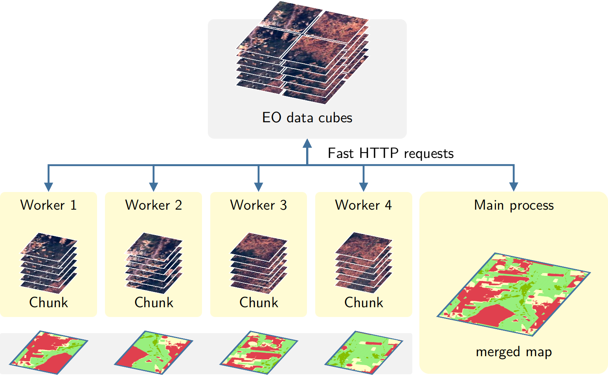

```{r, include = FALSE}
source("common.R")
```

# Classification of Images in Data Cubes using Satellite Image Time Series

---

This chapter shows the use of the SITS package for classification of satellite images that are associated to Earth observation data cubes.

---


## Data cube classification

To classify a data cube, use the function `sits_classify()`.  This function works in the same way for all types of data cubes, regardless of origin. When working with big EO data, the target environment for `sits` is a multicore virtual machine located close to the data repository. To achieve efficiency, `sits` implements parallel processing using the cores of the virtual machine. Users are not burdened with the need to learn how to do multiprocessing and, thus, their learning curve is shortened.

The authors implemented a new fault tolerant multitasking procedure for big EO data classification. Image classification in `sits` is done by a cluster of independent workers linked to a virtual machine. To avoid communication overhead, all large payloads are read and stored independently; direct interaction between the main process and the workers is kept at a minimum. The customised approach is depicted in the figure below.

1. Based on the size of the cube, the~number of cores, and~the available memory, divide the cube into chunks.
2. The cube is divided into chunks along its spatial dimensions. Each chunk contains all temporal intervals.
3. Assign chunks to the worker cores. Each core processes a block and produces an output image that is a subset of the result.
4. After all the subimages are produced, join them to obtain the result.
5. If a worker fails to process a block, provide failure recovery and ensure the worker completes the job.

```{r, out.width = "90%", out.height = "90%", echo = FALSE, fig.align="center", fig.cap="Parallel processing in sits (source: Simoes et al.(2021)"}


```

This approach has many advantages. It works in any virtual machine that supports R and has no dependencies on proprietary software. Processing is done in a concurrent and independent way, with no communication between workers. Failure of one worker does not cause failure of the big data processing. The~software is prepared to resume classification processing from the last processed chunk, preventing against failures such as memory exhaustion, power supply interruption, or network breakdown. From~an end-user point of view, all work is done smoothly and transparently. 

The classification algorithm allows users to choose how many processes will run the task in parallel, and also the size of each data chunk to be consumed at each iteration. This strategy enables `sits` to work on average desktop computers without depleting all computational resources. The code bellow illustrates how to classify a large brick image that accompany the package. 

To reduce processing time, it is necessary to adjust `sits_classify()` according to the capabilities of the host environment. There is a trade-off between computing time, memory use, and I/O operations. The best trade-off has to be determined by the user, considering issues such disk read speed, number of cores in the server, and CPU performance.  The `memsize` parameter controls the size of the main memory (in GBytes) to be used for classification. A practical approach is to set `memsize` to about 50% of the total memory available in the virtual machine. Users choose the number of cores to be used for parallel processing by setting the parameter `multicores`. For small imagens, we suggest using a small number of cores (up to 4). In the case of big data, our experience is to use about 50% of the cores. 


## Processing time estimates 

Processing time depends on the data size and the model used. Some estimates derived from experiments made the authors show that:

1. Classification of one year of the entire Cerrado region of Brazil (2,5 million $kmˆ2$) using 18 tiles of CBERS-4 AWFI images (64 meter resolution), each tile consisting of 10,504 x 6,865 pixels with 24 time instances, using 4 spectral bands, 2 vegetation indexes and a cloud mask, resulting in 1,7 TB, took 16 hours using 100 GB of memory and 20 cores of a virtual machine. The classification was done with a random forest model with 2000 trees.

2. Classification of one year in one tile of LANDSAT-8 images (30 meter resolution), each tile consisting of 11,204 x 7,324 pixels with 24 time instances, using 7 spectral bands, 2 vegetation indexes and a cloud mask, resulting in 157 GB, took 90 minutes using 100 GB of memory and 20 cores of a virtual machine. The classification was done with a random forest model with 2000 trees.

3. The Brazilian Cerrado is covered by 51 Landsat-8 tiles available in the Brazil Data Cube (BDC). Each Landsat tile in the BDC covers a 3&deg; $\times$ 2&deg; grid in Albers equal area projection with an area of 73,920 km$^2$, and a size of 11,204 $\times$ 7324 pixels. The~one-year classification period ranges from September 2017 to August 2018, following the agricultural calendar. The~temporal interval is 16 days, resulting in 24 images per tile. We use seven spectral bands plus two vegetation indexes (NDVI and EVI) and the cloud cover information. The total input data size is about 8 TB. A data set of 48,850 samples was used to train a convolutional neural network model using the TempCNN method. All available attributes in the BDC Landsat-8 data cube (two vegetation indices and seven spectral bands) were used for training and classification. The classification was executed on an Ubuntu server with 24 cores and 128 GB memory. Each Landsat-8 tile was classified in an average of 30 min, and~the total classification took about 24 h. 

