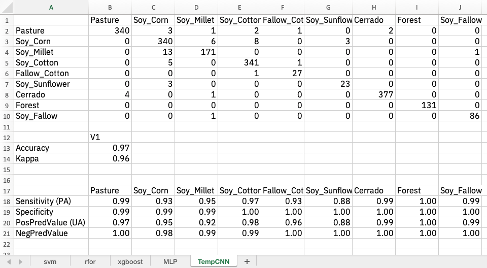

# Validation and accuracy measurements in SITS

---

This chapter presents the validation and accuracy measures available in the SITS package.

---

```{r, include = FALSE}
source("common.R")
```

## Validation techniques

Validation is a process undertaken on models to estimate some error associated with them, and hence has been used widely in different scientific disciplines. Here, we are interested in estimating the prediction error associated to some model. For this purpose, we concentrate on the *cross-validation* approach, probably the most used validation technique [@Hastie2009].

Cross-validation estimates the expected prediction error. It uses part of the available samples to fit the classification model, and a different part to test it. The so-called *k-fold* validation, we split the data into $k$ partitions with approximately the same size and proceed by fitting the model and testing it $k$ times. At each step, we take one distinct partition for test and the remaining ${k-1}$ for training the model, and calculate its prediction error for classifying the test partition. A simple average gives us an estimation of the expected prediction error. 

A natural question that arises is: *how good is this estimation?* According to @Hastie2009, there is a bias-variance trade-off in choice of $k$. If $k$ is set to the number of samples, we obtain the so-called *leave-one-out* validation, the estimator gives a low bias for the true expected error, but produces a high variance expectation. This can be computational expensive as it requires the same number of fitting process as the number of samples. On the other hand, if we choose ${k=2}$, we get a high biased expected prediction error estimation that overestimates the true prediction error, but has a low variance. The recommended choices of $k$ are $5$ or $10$, which somewhat overestimates the true prediction error.

`sits_kfold_validate()` gives support the k-fold validation in `sits`. The following code gives an example on how to proceed a k-fold cross-validation in the package. It perform a five-fold validation using SVM classification model as a default classifier. We can see in the output text the corresponding confusion matrix and the accuracy statistics (overall and by class).

```{r}
# perform a five fold validation for the "cerrado_2classes" data set
# Random Forest machine learning method using default parameters
val_rfor <- sits_kfold_validate(cerrado_2classes, 
                                     folds = 5, 
                                     ml_method = sits_rfor())
# print the validation statistics
val_rfor
```

## Comparing different machine learning methods using k-fold validation

One useful function in SITS is the capacity to compare different validation methods and store them in an XLS file for further analysis. The following example shows how to do this, using the Mato Grosso data set. We take five models: random forests(`sits_rfor`), support vector machines (`sits_svm`), extreme gradient boosting (`sits_xgboost`), multi-layer perceptron (`sits_mlp`) and temporal convolutional neural network (`sits_TempCNN`). For simplicity, we use the default parameters provided by sits. After computing the confusion matrix and the statistics for each model, we store the result in a list. When the calculation is finished, the function `sits_to_xlsx` writes all of the results in an Excel-compatible spreadsheet.


```{r, eval = FALSE}
# Retrieve the set of samples for the Mato Grosso region (provided by EMBRAPA)
data("samples_matogrosso_mod13q1")
# create a list to store the results
results <- list()

# SVM model
conf_svm <- sits_kfold_validate(
    samples_matogrosso_mod13q1,
    ml_method = sits_svm())
# Give a name to the SVM model
conf_svm$name <- "svm"
# store the result
results[[length(results) + 1]] <- conf_svm

# Random Forest
conf_rfor <- sits_kfold_validate(
    samples_matogrosso_mod13q1,
    folds = 5,
    multicores = 2,
    ml_method = sits_rfor())
# Give a name to the results 
conf_rfor$name <- "rfor"
# store the results in a list
results[[length(results) + 1]] <- conf_rfor

## Extreme Gradient Boosting
conf_xgb <- sits_kfold_validate(
    samples_matogrosso_mod13q1,
    ml_method = sits_xgboost())

# Give a name to the SVM model
conf_xgb$name <- "xgboost"
# store the results in a list
results[[length(results) + 1]] <- conf_xgb

# Multi-layer perceptron
conf_mlp <- sits_kfold_validate(
    samples_matogrosso_mod13q1,
    ml_method = sits_mlp())

# Give a name to the SVM model
conf_mlp$name <- "MLP"
# store the results in a list
results[[length(results) + 1]] <- conf_mlp

# Temporal CNN
conf_tcnn <- sits_kfold_validate(
    samples_matogrosso_mod13q1,
    ml_method = sits_TempCNN())

# Give a name to the SVM model
conf_tcnn$name <- "TempCNN"
# store the results in a list
results[[length(results) + 1]] <- conf_tcnn

xlsx_file <- paste0(getwd(),"/model_comparison.xlsx")
# Save to an XLS file
sits_to_xlsx(results, file = xlsx_file)
```
The resulting Excel file can be opened with R or using spreadsheet programs. The figure below shows a printout of what is read by Excel. As shown below, each sheet corresponds to the output of one model. For simplicity, we show only the result of TempCNN, that has an overall accuracy of 97% and is the best-performing model. 

```{r, echo = FALSE, fig.align="center", out.width = "90%", out.height = "90%", fig.cap= "Result of 5-fold cross validation of Mato Grosso dataset using TempCNN"}



```

## Accuracy assessment 

### Time series

Users can perform accuracy assessment in *sits* both in time series datasets or in classified images using the `sits_accuracy` function. In the case of time series, the input is a sits tibble which has been classified by a sits model. The input tibble needs to contain valid labels in its "label" column. These labels are compared to the results of the prediction to the reference values. This function calculates the confusion matrix and then the resulting statistics using the R package "caret". 

```{r}
# read a tibble with 400 time series of Cerrado and 346 of Pasture
data(cerrado_2classes)
# create a model for classification of time series
svm_model <- sits_train(cerrado_2classes, sits_svm())
# classify the time series
predicted <- sits_classify(cerrado_2classes, svm_model)
# calculate the classification accuracy
acc_ts <- sits_accuracy(predicted)
# print the accuracy statistics summary
sits_accuracy_summary(acc_ts)
```
The detailed accuracy measures can be obtained by printing the accuracy object.

```{r}
# print the accuracy statistics
acc_ts 
```

### Classified images 

To measure the accuracy of classified images, the `sits_accuracy` function uses an area-weighted technique, following the best practices proposed by @Olofsson2013. The need for area-weighted estimates arises from the fact the land use and land cover classes are not evenly distributed in space. In some applications (e.g., deforestation) where the interest lies in assessing how much of the image has changed, the area mapped as deforested is likely to be a small fraction of the total area. If users disregard the relative importance of small areas where change is taking place, the overall accuracy estimate will be inflated and unrealistic. For this reason, @Olofsson2013 argue that *"mapped areas should be adjusted to eliminate bias attributable to map classification error and these error-adjusted area estimates should be accompanied by confidence intervals to quantify the sampling variability of the estimated area"*.

With this motivation, when measuring accuracy of classified images, the function `sits_accuracy` follows @Olofsson2013 and @Olofsson2014.  The following explanation is extracted from the paper of @Olofsson2013, and users should refer to this paper for further explanation.

Given a classified image and a validation file, the first step is to calculate the confusion matrix in the traditional way, i.e., by identifying the commission and omission errors. Then we calculate the unbiased estimator of the proportion of area in cell $i,j$ of the error matrix

$$
\hat{p_{i,j}} = W_i\frac{n_{i,j}}{n_i}
$$
where the total area of the map is $A_{tot}$, the mapping area of class $i$ is $A_{m,i}$ and the proportion of area mapped as class $i$ is $W_i = {A_{m,i}}/{A_{tot}}$. Adjusting for area size allows producing an unbiased estimation of the total area of class $j$, defined as a stratified estimator
$$
\hat{A_j} = A_{tot}\sum_{i=1}^KW_i\frac{n_{i,j}}{n_i}
$$
This unbiased area estimator includes the effect of false negatives (omission error) while not considering the effect of false positives (commission error). The area estimates also allow producing an unbiased estimate of the user's and producer's accuracy for each class. Following @Olofsson2013, we can also estimate the 95% confidence interval for $\hat{A_j}$. 

To use the `sits_accuracy` function to produce the adjusted area estimates, users have to provide the classified image together with a csv file containing a set of labeled points. The csv file should have the same format as the one used to obtain samples, as discussed earlier. 

In what follows, we show a simple example of using the accuracy function to estimate the quality of the classification
```{r}
# select a sample with 2 bands (NDVI and EVI)
samples_modis_2bands <- sits_select(samples_modis_4bands,
                                     bands = c("NDVI", "EVI"))
# build an extreme gradient boosting model
xgb_model <- sits_train(samples_modis_2bands, ml_method = sits_xgboost())
# create a data cube based on files
data_dir <- system.file("extdata/raster/mod13q1", package = "sits")
cube <- sits_cube(
    source = "LOCAL",
    name = "sinop-2014",
    satellite = "TERRA",
    sensor = "MODIS",
    data_dir = data_dir,
    delim = "_",
    parse_info = c("X1", "X2", "band", "date")
)
# classify the data cube with xgb model
probs_cube <- sits_classify(cube, xgb_model)
# label the classification
label_cube <- sits_label_classification(probs_cube, output_dir = tempdir())
# get ground truth points
ground_truth <- system.file("extdata/samples/samples_sinop_crop.csv",
                            package = "sits")
# calculate accuracy according to Olofsson's method
area_acc <- sits_accuracy(label_cube, validation_csv = ground_truth)
# print the area estimated accuracy 
area_acc
```

This is an illustrative example to express the situation where there is a limited number of ground truth points. As a result of a limited validation sample, the estimated confidence interval in area estimation is large. This indicates a questionable result. We recommend that users follow the procedures recommended by @Olofsson2014 to estimate the number of ground truth measures per class that are required to get a reliable estimate. 


