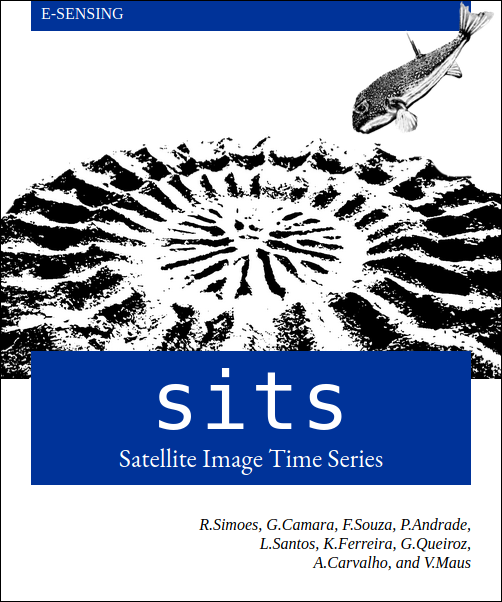

--- 
knit: "bookdown::render_book"
title: '**sits**: Data Analysis and Machine Learning for Data Cubes using Satellite Image Time Series'
author:
- affiliation: National Institute for Space Research (INPE), Brazil
  name: Rolf Simoes
- affiliation: National Institute for Space Research (INPE), Brazil
  name: Gilberto Camara
- affiliation: National Institute for Space Research (INPE), Brazil
  name: Felipe Souza
- affiliation: National Institute for Space Research (INPE), Brazil
  name: Lorena Santos
- affiliation: National Institute for Space Research (INPE), Brazil
  name: Pedro R. Andrade
- affiliation: Institute for Applied Economics Research (IPEA), Brazil
  name: Alexandre Carvalho
- affiliation: National Institute for Space Research (INPE), Brazil
  name: Karine Ferreira
- affiliation: National Institute for Space Research (INPE), Brazil
  name: Gilberto Queiroz
date: "`r Sys.Date()`"
site: bookdown::bookdown_site
documentclass: book
cover-image: images/cover.png
bibliography:
- book.bib
- packages.bib
- references-sits.bib
biblio-style: apalike
link-citations: yes
description: | 
  This is a minimal example of using the bookdown package to write a book.
  The output format for this example is bookdown::gitbook.
---

```{r, include = FALSE}
source("common.R")
```

# Preface {-}

<a href="https://github.com/e-sensing/sitsbook"></a>

<!-- [{.cover width="326"}](https://github.com/e-sensing/sits-book) -->

Abstract from Filters: This vignette describes the time series filtering techniques available in
the SITS package. These include the Savitsky-Golay, Whittaker, and Kalman filters,
as well as specialised filters for satellite images, which are the envelope filter
and the ARIMA filter for cloud removal.

Abstract from clustering: One of the key challenges when using samples to train machine learning classification models is assessing their quality. Noisy and imperfect training samples can have a negative effect on classification performance.  Therefore, it is useful to apply pre-processing methods to improve the quality of the samples and to remove those that might have been wrongly labeled or that have low discriminatory power. Representative samples lead to good classification maps. `sits` provides support for two clustering methods to test sample quality, which are agglomerative hierarchical clustering (AHC) and self-organizing maps (SOM).
  
Abstract from clustering: One of the key challenges when using samples to train machine learning classification models is assessing their quality. Noisy and imperfect training samples can have a negative effect on classification performance.  Therefore, it is useful to apply pre-processing methods to improve the quality of the samples and to remove those that might have been wrongly labeled or that have low discriminatory power. Representative samples lead to good classification maps. `sits` provides support for two clustering methods to test sample quality, which are agglomerative hierarchical clustering (AHC) and self-organizing maps (SOM).
