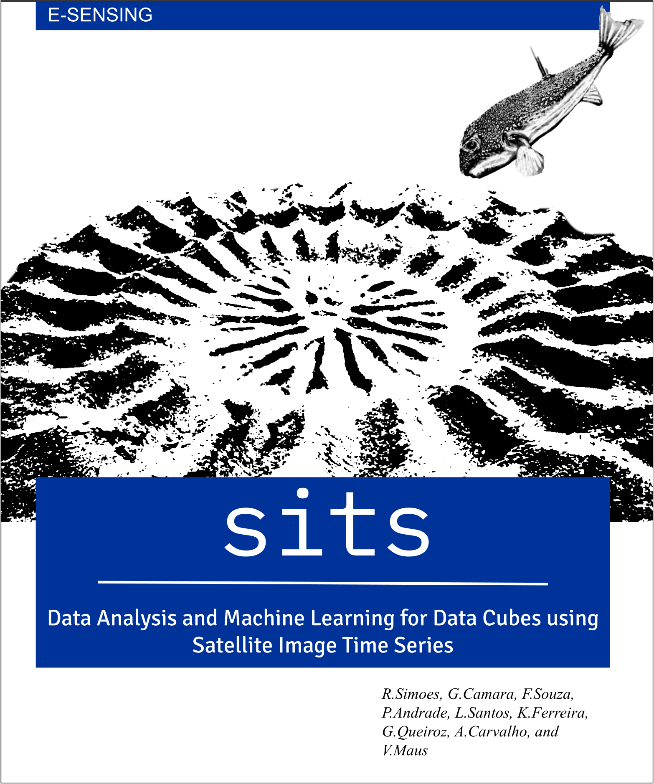

--- 
knit: "bookdown::render_book"
title: '**sits**: Data Analysis and Machine Learning on Earth Observation Data Cubes with Satellite Image Time Series'
author: ["Rolf Simoes", "Gilberto Camara", "Felipe Souza", "Lorena Santos", "Pedro R. Andrade", "Alexandre Carvalho", "Karine Ferreira", "Gilberto Queiroz", "Victor Maus"]
date: "`r Sys.Date()`"
site: bookdown::bookdown_site
documentclass: book
output:
  html_document:
    df_print: kable
cover-image: images/cover.png
bibliography:
- references-sits.bib
biblio-style: apalike
description: | 
  This book presents  **sits**, an open-source R package for satellite image time series analysis. The package supports the application of machine learning techniques for classification image time series obtained from data cubes.
---
```{r, setup, include=FALSE}
knitr::opts_chunk$set(
  class.output = 'sourceCode'
)
```

```{r, include = FALSE}
source("common.R")
```

# Preface {-}

<a href="https://github.com/e-sensing/sitsbook"></a>

Using time series derived from big Earth Observation data sets is one of the leading research trends in Land Use Science and Remote Sensing. One of the more promising uses of satellite time series is its application to classify land use and land cover since our growing demand for natural resources has caused significant environmental impacts. 

This book presents  **sits**, an open-source R package for satellite image time series analysis. The package supports the application of machine learning techniques for classification image time series obtained from data cubes. Methods available include linear and quadratic discrimination analysis, support vector machines, random forests, boosting, deep learning, and convolution neural. The package also provides functions to post-classification and sample quality assessment.

## Who this book is for {-}

This book is recommended for researchers and experts that want to use the full potential of Earth observation data cubes for time series analysis and classification. Ideally, users should have basic knowledge of data science methods using R. The examples of the book are largely self-explanatory. Background information for the data science methods used in the book is available in the following references:

- Wickham, H.; Golemund, G., ["R for Data Science"](https://r4ds.had.co.nz/). O'Reilly, 2017.

- James, G.; Witten, D.; Hastie, T.; Tibshirani, R. ["An Introduction to Statistical Learning with Applications in R"](https://www.statlearning.com/). Springer, 2013.


## How to use this book {-}

This book describes sits version 0.11.0. Download and install sits as explained in the Setup. Start at Chapter 1 to get an overview of the package. Then feel free to browse the chapter for more information on topics you are interested with. 


| **Chapter**   | **Description**                                                                                            |
|---------------|------------------------------------------------------------------------------------------------------------|
| [Chr 1](https://e-sensing.github.io/sitsbook/introduction.html) | Provides an overview of  **sits** package.                                                   |
| [Chr 2](https://e-sensing.github.io/sitsbook/earth-observation-data-cubes.html) | Describes how to work with Earth observation data cubes  in sits.                                          |
| [Chr 3](https://e-sensing.github.io/sitsbook/acessing-time-series-information-in-sits.html) | Describes how to access information from time series in sits.                          |
| [Chr 4](https://e-sensing.github.io/sitsbook/time-series-clustering-to-improve-the-quality-of-training-samples.html) | Improving the quality of the samples used in training models |
| [Chr 5](https://e-sensing.github.io/sitsbook/machine-learning-for-data-cubes-using-the-sits-package.html) | Presents the machine learning techniques available in sits.                   |
| [Chr 6](https://e-sensing.github.io/sitsbook/classification-of-images-in-data-cubes-using-satellite-image-time-series.html) | Describes how to classify satellite images associated with Earth observation data cubes.   |
| [Chr 7](https://e-sensing.github.io/sitsbook/post-classification-smoothing-using-bayesian-techniques-in-sits.html) | Describes smoothing method to reclassify the pixels based on the machine learning probabilities |
| [Chr 8](https://e-sensing.github.io/sitsbook/validation-and-accuracy-measurements-in-sits.html) | Presents the validation and accuracy measures available in sits.    |


## Publications using sits {-}

This section gathers the publications that have used sits to generate the results.


**2021**

- [1] Lorena Santos, Karine Ferreira at el., "Identifying Spatiotemporal Patterns in Land Use and Cover Samples from Satellite Image Time Series". Remote Sens. 2021, 13, 974. 


**2020**

- [2] Rolf Simoes, Michelle Picoli, et al.,  "Land use and cover maps for Mato Grosso State in Brazil from 2001 to 2017".  Sci Data 7, 34 (2020).

- [4] Michelle Picoli, Ana Rorato, et al., "Impacts of Public and Private Sector Policies on Soybean and Pasture Expansion in Mato Grosso – Brazil from 2001 to 2017". Land 2020, 9, 20.

- [5] Ferreira, K.R.; Queiroz, G.R. "Earth Observation Data Cubes for Brazil: Requirements, Methodology and Products". Remote Sens. 2020, 12, 4033.

**2019**

- [6] Alber Sanchez, Michelle Picoli, et al., "Land Cover Classifications of Clear-cut Deforestation Using Deep Learning". In: SIMPÓSIO BRASILEIRO DE GEOINFORMÁTICA (GEOINFO), 2019, São José dos Campos. São José dos Campos: INPE, 2019. On-line.

- [7] Lorena Santos, Karine Ferreira, et al., "Self-Organizing Maps in Earth Observation Data Cubes Analysis". 13th International Workshop on Self-Organizing Maps and Learning Vector Quantization, Clustering and Data Visualization (WSOM+ 2019), Barcelona, Spain, June 26-28, 2019.

**2018**

- [8] Michelle Picoli, Gilberto Camara, et al.,  “Big Earth Observation Time Series Analysis for Monitoring Brazilian Agriculture”. ISPRS Journal of Photogrammetry and Remote Sensing, 2018.

## Reproducible papers used in building sits functions {-}

We thank the authors of these papers for making their code available to be used in sits.

- [1] Appel, Marius, and Edzer Pebesma, “On-Demand Processing of Data Cubes from Satellite Image Collections with the Gdalcubes Library.” Data 4 (3): 1–16, 2020.

- [2] Karim, Fazle, Somshubra Majumdar, Houshang Darabi, and Shun Chen, “LSTM Fully Convolutional Networks for Time Series Classification.” IEEE Access 6: 1662–9, 2018.

- [3] Hassan Fawaz, Germain Forestier, Jonathan Weber, Lhassane Idoumghar,  and Pierre-Alain Muller, "Deep learning for time series classification: a review". Data Mining and Knowledge Discovery, 33(4): 917--963, 2019.

- [4] Pebesma, Edzer, "Simple Features for R: Standardized Support for Spatial Vector Data". R Journal, 10(1):2018.

- [5] Pelletier, Charlotte, Geoffrey I. Webb, and Francois Petitjean. “Temporal Convolutional Neural Network for the Classification of Satellite Image Time Series.” Remote Sensing 11 (5), 2019. 

- [6] Wehrens, Ron and Kruisselbrink, Johannes. "Flexible Self-Organising Maps in kohonen 3.0". Journal of Statistical Software, 87, 7 (2018).
